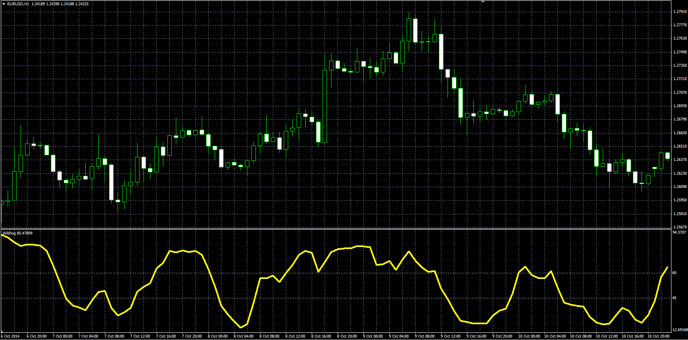

# Wildhog Oscillator

> Source: https://fxcodebase.com/code/viewtopic.php?f=38&t=61553  
> Forum: 38 · Topic 61553 · 1 post(s)

---

## Wildhog Oscillator

**Alexander.Gettinger** · Wed Nov 26, 2014 3:31 pm

Original LUA oscillator: [viewtopic.php?f=17&t=3499](https://fxcodebase.com/code/viewtopic.php?f=17&t=3499).

Formula:
Wildhog[i] = 100*(Close-Min)/(3*(Max-Min))+Wildhog[i-1], where
Max, Min - maximum and minimum prices at range from (i-Length+1) to (i).

 

Download:

 [Wildhog.mq4](files/97400/Wildhog.mq4)
