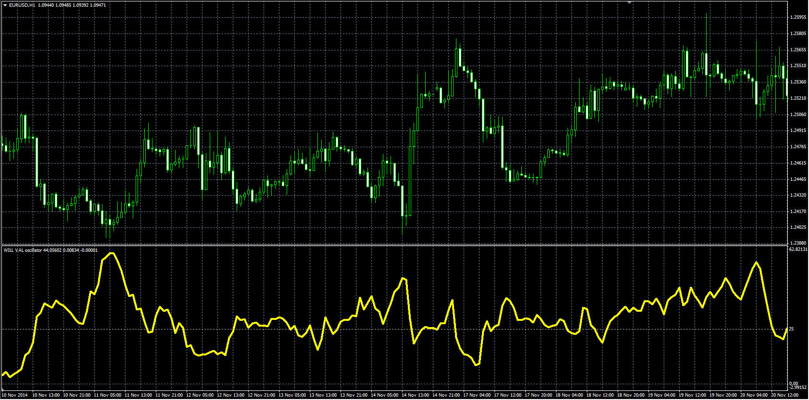

# WILL VAL

> Source: https://fxcodebase.com/code/viewtopic.php?f=38&t=62085  
> Forum: 38 · Topic 62085 · 1 post(s)

---

## WILL VAL

**Alexander.Gettinger** · Wed Apr 08, 2015 11:07 am

Original LUA oscillator: [viewtopic.php?f=17&t=61620](https://fxcodebase.com/code/viewtopic.php?f=17&t=61620).

Formulas:
WV[i] = 100*(Val[i]-Min)/(Max-Min), where
Val = MA1-MA2,
MA1 - EMA(Pr) with [Length1] number of periods,
MA2 - EMA(Pr) with [Length2] number of periods,
Max, Min - maximum and minimum Val at range from (i-Length3+1) to (i),
Pr = Close(Current instrument)/Close(Instrument).

 

Download:

 [WILL_VAL.mq4](files/99677/WILL_VAL.mq4)
