# William Blau's Indicators

> Source: https://fxcodebase.com/code/viewtopic.php?f=38&t=60201  
> Forum: 38 · Topic 60201 · 35 post(s)

---

## William Blau's Indicators

**Alexander.Gettinger** · Mon Jan 13, 2014 3:41 pm

Original oscillators and descriptions: [viewtopic.php?f=17&t=10878](https://fxcodebase.com/code/viewtopic.php?f=17&t=10878).

**Blau Candlestick Momentum**

 

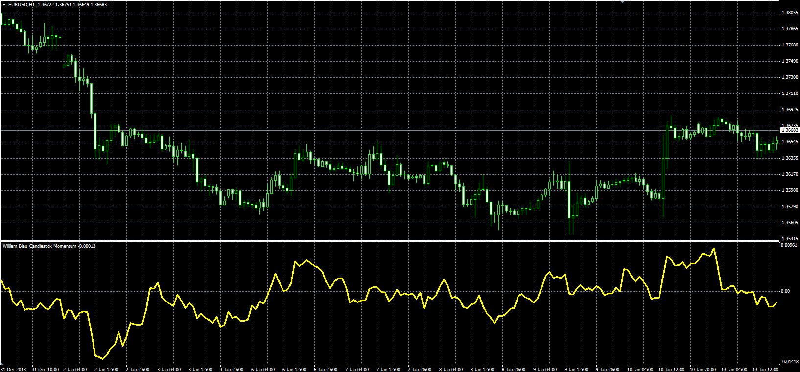

Download:

 [Blau_Candlestick_Momentum.mq4](files/91991/Blau_Candlestick_Momentum.mq4)

 [HTF_Blau_Candlestick_Momentum.mq4](files/91991/HTF_Blau_Candlestick_Momentum.mq4)

---

## Re: William Blau's Indicators

**Alexander.Gettinger** · Mon Jan 13, 2014 3:42 pm

**Blau Candlestick Index**

 

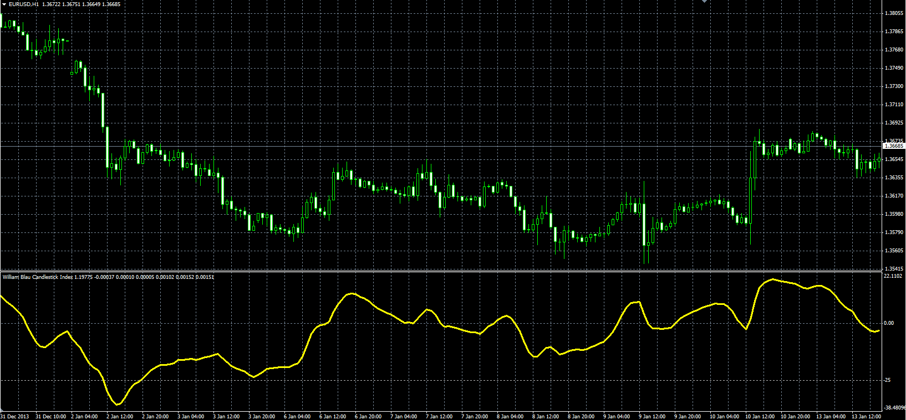

Download:

 [Blau_Candlestick_Index.mq4](files/91992/Blau_Candlestick_Index.mq4)

 [HTF_Blau_Candlestick_Index.mq4](files/91992/HTF_Blau_Candlestick_Index.mq4)

---

## Re: William Blau's Indicators

**Alexander.Gettinger** · Mon Jan 13, 2014 3:43 pm

**Blau True Strength Index**

 

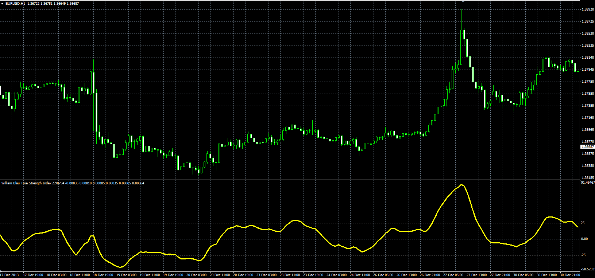

Download:

 [Blau_TSI.mq4](files/91993/Blau_TSI.mq4)

---

## Re: William Blau's Indicators

**Alexander.Gettinger** · Mon Jan 13, 2014 3:44 pm

**Blau Directional Trend Index**

 

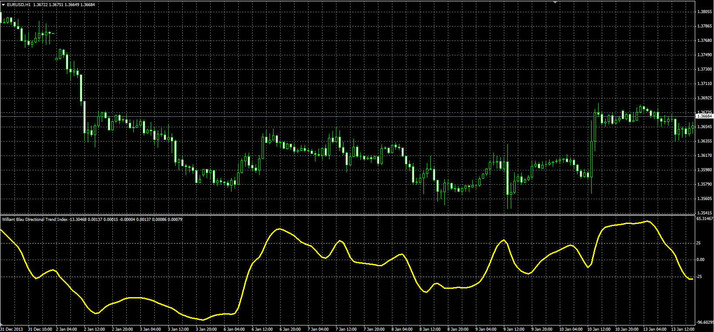

Download:

 [Blau_Directional_Trend_Index.mq4](files/91994/Blau_Directional_Trend_Index.mq4)

---

## Re: William Blau's Indicators

**Alexander.Gettinger** · Mon Jan 13, 2014 3:45 pm

**Blau Trend Momentum**

 

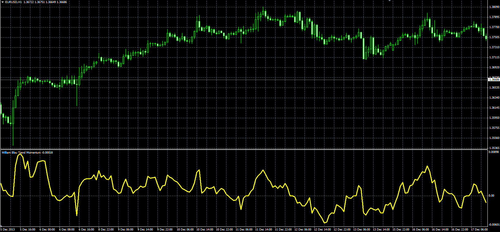

Download:

 [Blau_Trend_Momentum.mq4](files/91995/Blau_Trend_Momentum.mq4)

 [HTF_Blau_Trend_Momentum.mq4](files/91995/HTF_Blau_Trend_Momentum.mq4)

---

## Re: William Blau's Indicators

**Alexander.Gettinger** · Mon Jan 13, 2014 3:46 pm

**Blau Stochastic Index**

 

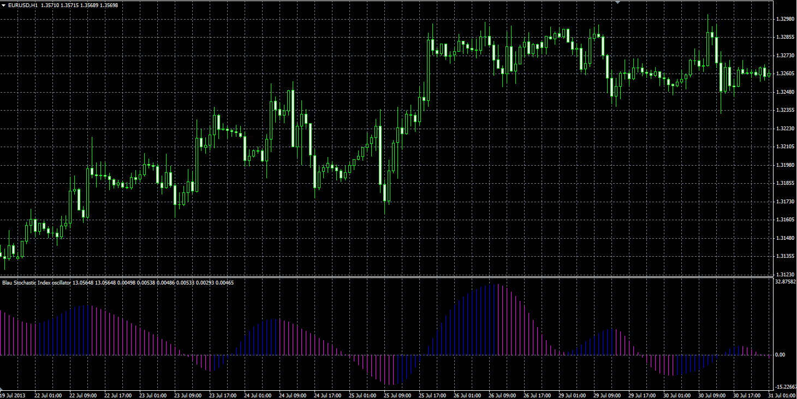

Download:

 [Blau_Stochastic_Index.mq4](files/91996/Blau_Stochastic_Index.mq4)

---

## Re: William Blau's Indicators

**Alexander.Gettinger** · Mon Jan 13, 2014 4:06 pm

**Blau Momentum**

 

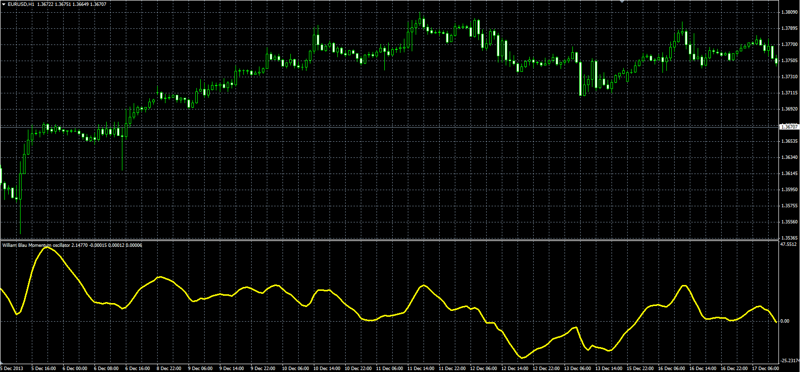

Download:

 [Blau_Mtm.mq4](files/91998/Blau_Mtm.mq4)

---

## Re: William Blau's Indicators

**Alexander.Gettinger** · Mon Jan 13, 2014 4:07 pm

**Blau Stochastic**

 

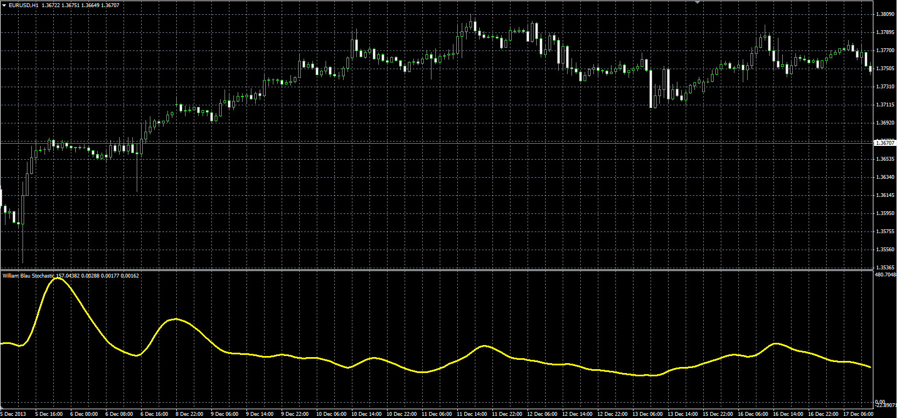

Download:

 [Blau_TStoch.mq4](files/91999/Blau_TStoch.mq4)

---

## Re: William Blau's Indicators

**Alexander.Gettinger** · Mon Jan 13, 2014 4:08 pm

**Blau Stochastic Oscillator**

 

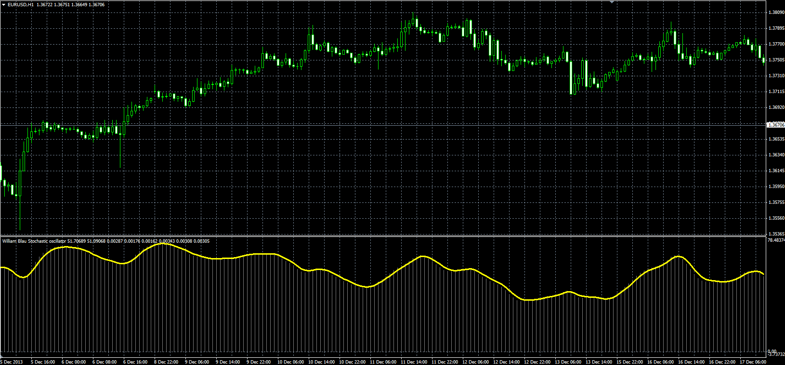

Download:

 [Blau_TS_Stochastic.mq4](files/92000/Blau_TS_Stochastic.mq4)

---

## Re: William Blau's Indicators

**Alexander.Gettinger** · Mon Jan 13, 2014 4:09 pm

**Blau Stochastic Momentum**

 

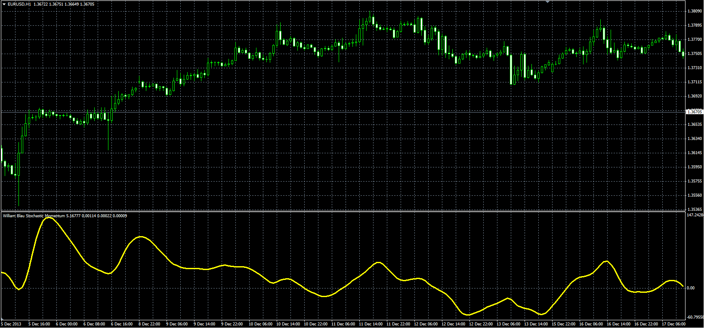

Download:

 [Blau_SM.mq4](files/92001/Blau_SM.mq4)

---

## Re: William Blau's Indicators

**Alexander.Gettinger** · Mon Jan 13, 2014 4:10 pm

**Blau Stochastic Momentum Index**

 

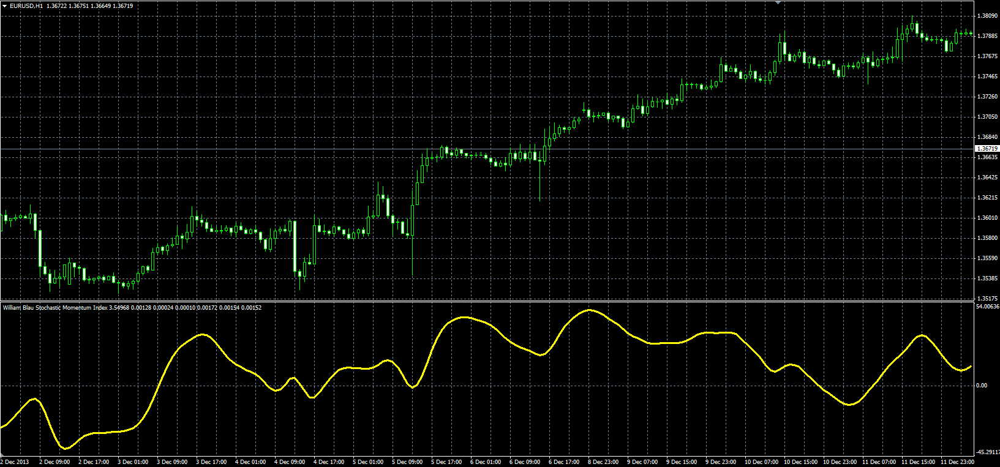

Download:

 [Blau_SMI.mq4](files/92002/Blau_SMI.mq4)

---

## Re: William Blau's Indicators

**Alexander.Gettinger** · Mon Jan 13, 2014 4:11 pm

**Blau Stochastic Momentum Oscillator**

 

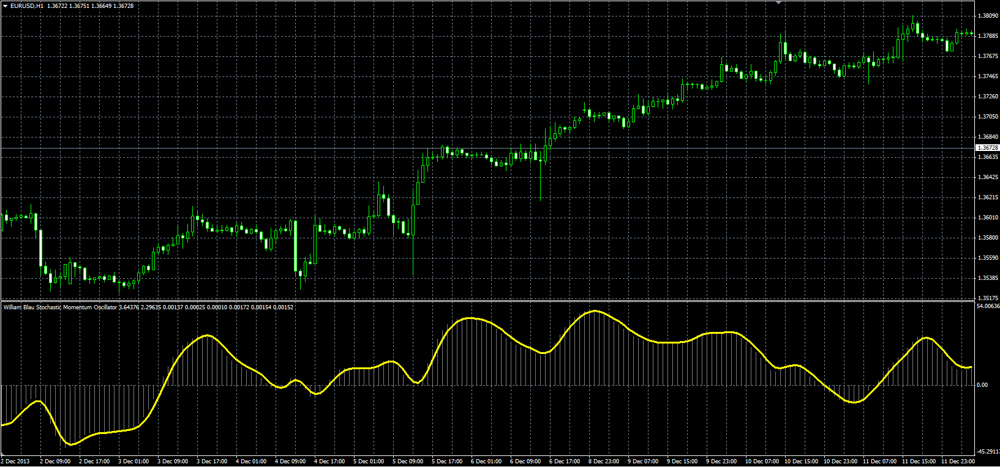

Download:

 [Blau_SM_Stochastic.mq4](files/92003/Blau_SM_Stochastic.mq4)

---

## Re: William Blau's Indicators

**Alexander.Gettinger** · Mon Jan 13, 2014 4:11 pm

**Blau Mean Deviation Index**

 

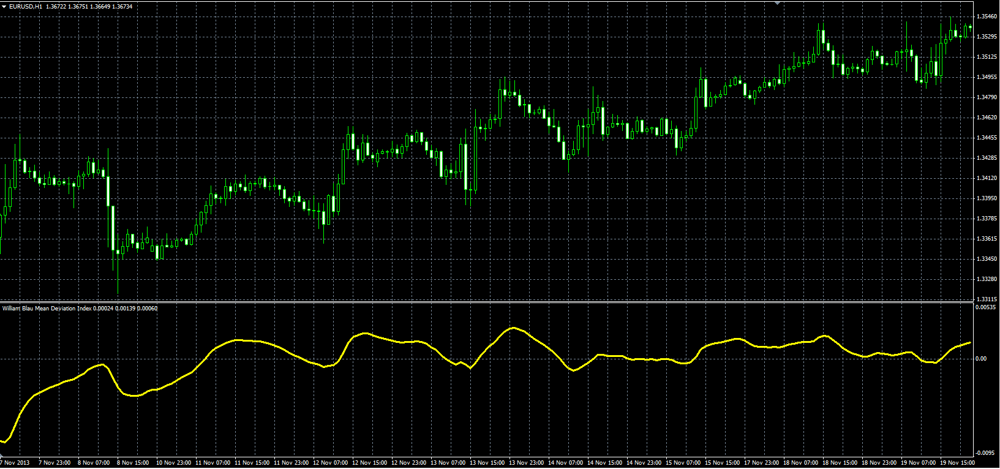

Download:

 [Blau_MDI.mq4](files/92004/Blau_MDI.mq4)

---

## Re: William Blau's Indicators

**Alexander.Gettinger** · Mon Jan 13, 2014 4:12 pm

**Blau Ergodic MDI oscillator**

 

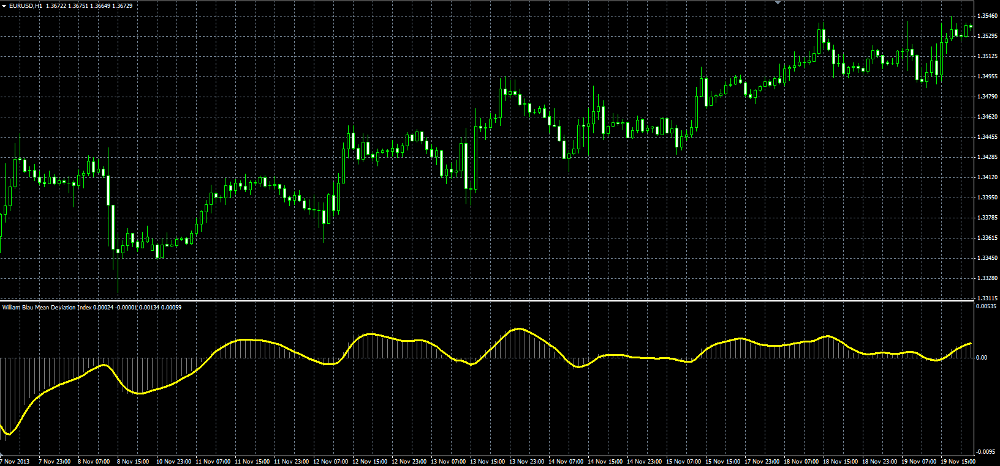

Download:

 [Blau_Ergodic_MDI.mq4](files/92005/Blau_Ergodic_MDI.mq4)

---

## Re: William Blau's Indicators

**Alexander.Gettinger** · Mon Jan 13, 2014 4:13 pm

**Blau MACD**

 

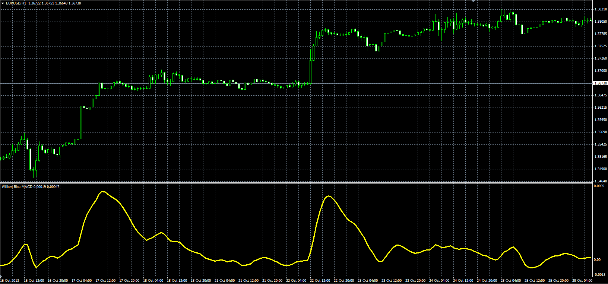

Download:

 [Blau_MACD.mq4](files/92006/Blau_MACD.mq4)

---

## Re: William Blau's Indicators

**Alexander.Gettinger** · Mon Jan 13, 2014 4:14 pm

**Blau Ergodic MACD**

 

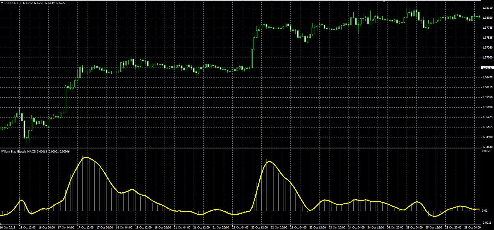

Download:

 [Blau_Ergodic_MACD.mq4](files/92007/Blau_Ergodic_MACD.mq4)

---

## Re: William Blau's Indicators

**Alexander.Gettinger** · Mon Jan 13, 2014 4:15 pm

**Blau Ergodic Oscillator**

 

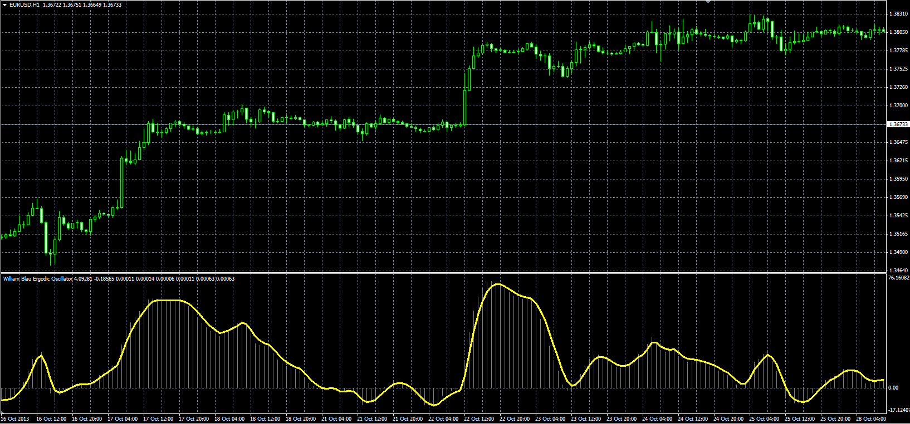

Download:

 [Blau_Ergodic.mq4](files/92008/Blau_Ergodic.mq4)

---

## Re: William Blau's Indicators

**Alexander.Gettinger** · Mon Jan 13, 2014 4:16 pm

**Blau Candlestick Momentum Index**

 

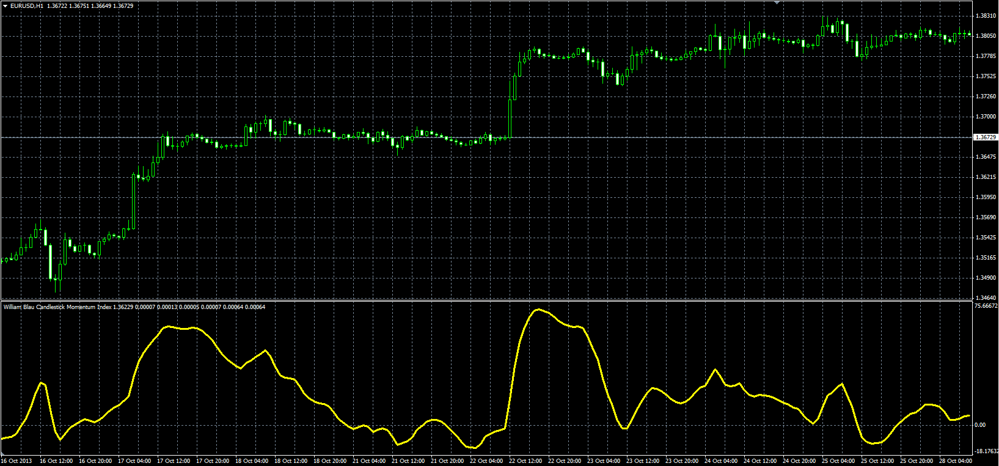

Download:

 [Blau_CMI.mq4](files/92009/Blau_CMI.mq4)

---

## Re: William Blau's Indicators

**Alexander.Gettinger** · Mon Jan 13, 2014 4:17 pm

**Blau Ergodic Candlestick Momentum Index**

 

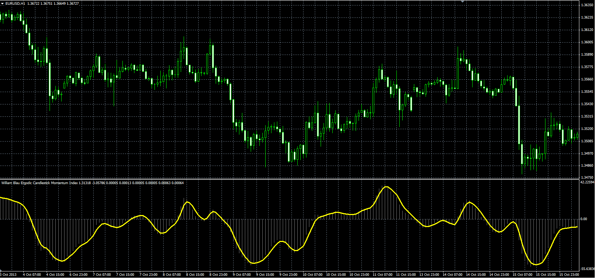

Download:

 [Blau_Ergodic_CMI.mq4](files/92010/Blau_Ergodic_CMI.mq4)

---

## Re: William Blau's Indicators

**Alexander.Gettinger** · Mon Jan 13, 2014 4:18 pm

**Blau Ergodic Candlestick Index**

 

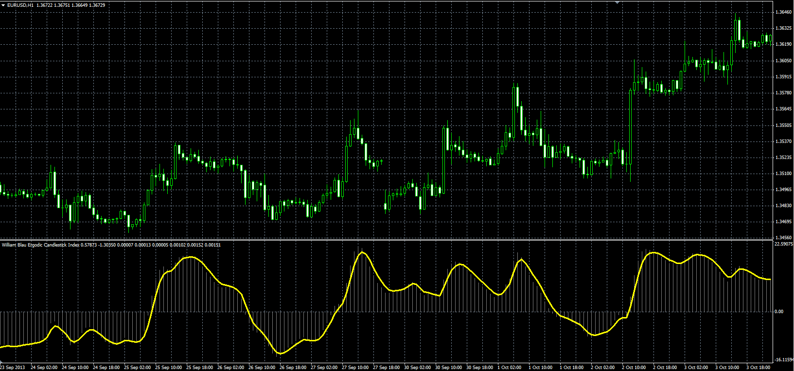

Download:

 [Blau_Ergodic_CSI.mq4](files/92011/Blau_Ergodic_CSI.mq4)

---

## Re: William Blau's Indicators

**Alexander.Gettinger** · Mon Jan 13, 2014 4:19 pm

**Blau Composite High-Low Momentum**

 

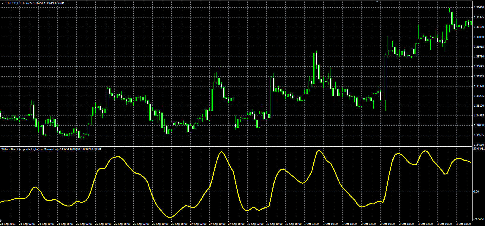

Download:

 [Blau_HLM.mq4](files/92012/Blau_HLM.mq4)

---

## Re: William Blau's Indicators

**Alexander.Gettinger** · Mon Jan 13, 2014 4:20 pm

**Blau Ergodic DTI-Oscillator**

 

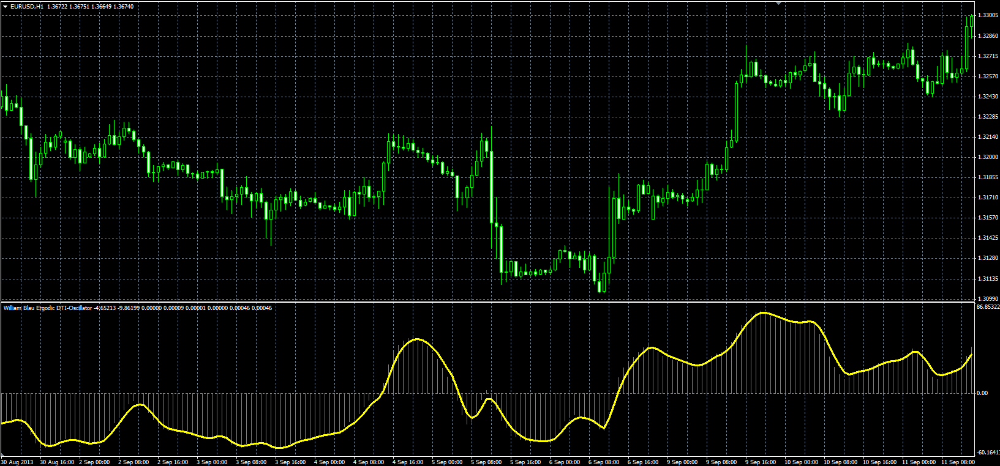

Download:

 [Blau_Ergodic_DTI.mq4](files/92013/Blau_Ergodic_DTI.mq4)

---

## Re: William Blau's Indicators

**logicgate** · Thu Dec 13, 2018 6:38 pm

> **Alexander.Gettinger wrote:**
> **Blau Ergodic DTI-Oscillator**
>
>
>
> The attachment **Blau_Ergodic_DTI_MQL.PNG** is no longer available
>
>
>
> Download:
>
>
> The attachment **Blau_Ergodic_DTI_MQL.PNG** is no longer available

Hello brother!

Would you be so kind to tweak this indi to become the DTI_Trend indicator?

It only needs a double smoothing of 25 and 13, as shown here:

---

## Re: William Blau's Indicators

**logicgate** · Fri Dec 14, 2018 7:23 am

Just would like to add to my comment above, I think that the DTI_Trend indicator would be way more useful if it had a MTF (multi timeframe) capacity, because then we could load it on a 15min for example, and choose for it to show the DTI_Trend of a 1h chart. You know when your high time frame is trending up or down and take the trades with the trend, without the need to check the higher TF chart...

---

## Re: William Blau's Indicators

**Apprentice** · Fri Dec 14, 2018 1:32 pm

Your request is added to the development list under Id Number 4366

---

## Re: William Blau's Indicators

**Apprentice** · Mon Dec 17, 2018 5:19 am

[Blau_Ergodic_DTI_Trade_BTF.mq4](files/122882/Blau_Ergodic_DTI_Trade_BTF.mq4)

I'm not sure what exactly you expects.
You asked of MA of MA of DTI.
DTI is MA of MA of MA + formula.
Should it be MA of MA of (MA of MA of MA + formula)?
Or do you need DTI with only two MA?
We implemented this option (+BTF)

---

## Re: William Blau's Indicators

**logicgate** · Mon Dec 17, 2018 12:41 pm

> **Apprentice wrote:**
>
>
> Blau_Ergodic_DTI_Trade_BTF.mq4
>
>
> I'm not sure what exactly you expects.
> You asked of MA of MA of DTI.
> DTI is MA of MA of MA + formula.
> Should it be MA of MA of (MA of MA of MA + formula)?
> Or do you need DTI with only two MA?
> We implemented this option (+BTF)

Hello brother! Thanks for replying.

I expect the indicator to plot like the one in the second Image, the indicator on the lower window called DTI_Trend. It only plots above zero when the DTI is above zero and slope is up and level. When it starts turning down it goes to zero. Same thing when the DTI is below zero and the slope is down and level, the DTI_Trend keeps plotting, when it starts to turn up it goes to zero.

I am sorry I am away from home now for the next couple of days I can't test it.

---

## Re: William Blau's Indicators

**Apprentice** · Tue Dec 18, 2018 5:55 am

Try this version.
[viewtopic.php?f=38&t=67176](https://fxcodebase.com/code/viewtopic.php?f=38&t=67176)

---

## Re: William Blau's Indicators

**Apprentice** · Fri Feb 01, 2019 6:29 am

[Blau_SMI_averages.mq4](files/123638/Blau_SMI_averages.mq4)

Blau_SMI_averages with VWMA added.

---

## Re: William Blau's Indicators

**logicgate** · Sat Feb 02, 2019 8:11 am

> **Apprentice wrote:**
>
>
> Blau_SMI_averages.mq4
>
>
> Blau_SMI_averages with VWMA added.

Brilliant!! Thanks!!

---

## Re: William Blau's Indicators

**richard19** · Tue Oct 01, 2019 10:23 pm

> **Alexander.Gettinger wrote:**
> **Blau Trend Momentum**
>
>
>
> Blau_Trend_Momentum_MQL.PNG
>
>
>
> Download:
>
>
> Blau_Trend_Momentum.mq4

Dear Apprentice.

Could you please make this indicator higher time frame?

thank you

regards
Richard

Blau_Trend_Momentum.mq4

---

## Re: William Blau's Indicators

**Apprentice** · Wed Oct 02, 2019 5:59 am

Your request is added to the development list.
Development reference 145.

---

## Re: William Blau's Indicators

**richard19** · Wed Oct 02, 2019 11:50 pm

Dear Apprentice,

Could you please add these two indicators as well to the request? It will be great to have them as higher time frame indicators;

Blau_Candlestick_Momentum.mq4
Blau_Candlestick_Index.mq4

thank you

regards
Richard

---

## Re: William Blau's Indicators

**Apprentice** · Wed Oct 09, 2019 1:05 pm

Added.

---

## Re: William Blau's Indicators

**richard19** · Thu Oct 10, 2019 9:42 pm

> **Apprentice wrote:**
> Added.

Dear Apprentice

Thank you very much

Richard
