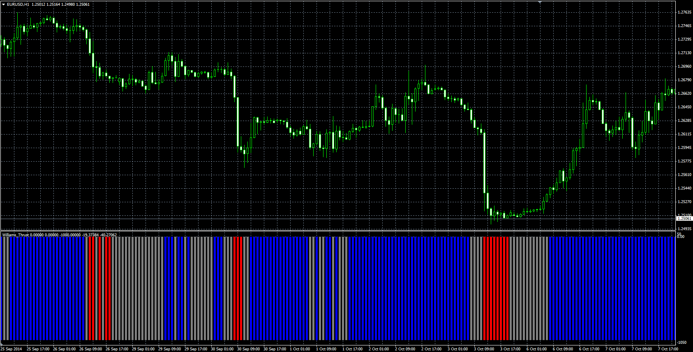

# Williams Thrust

> Source: https://fxcodebase.com/code/viewtopic.php?f=38&t=61630  
> Forum: 38 · Topic 61630 · 1 post(s)

---

## Williams Thrust

**Alexander.Gettinger** · Mon Dec 22, 2014 10:45 am

Original LUA oscillator: [viewtopic.php?f=17&t=2522](https://fxcodebase.com/code/viewtopic.php?f=17&t=2522).

> If Williams % R (250) > EMA (50) of Williams % R (250) AND
> If Williams % R (50) > EMA (10) of Williams % R (50) = Positive Thrust (Buy Signal)
>
> If Williams % R (250) < EMA (50) of Williams % R (250) AND
> If Williams % R (50) < EMA (10) of Williams % R (50) = Negative Thrust (Sell Signal)

 

Download:

 [Williams_Thrust.mq4](files/97841/Williams_Thrust.mq4)
