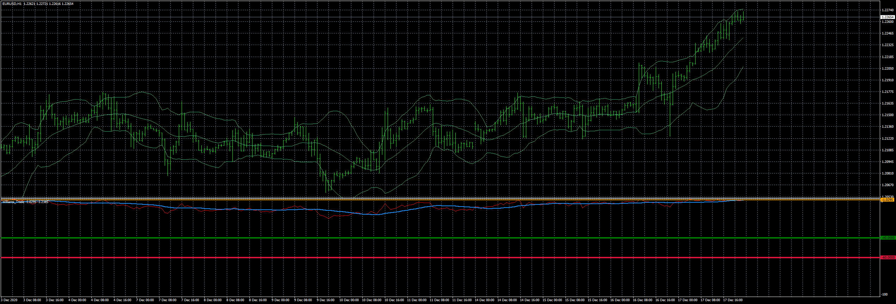

# WilliamsTrade_and_BB_EA

> Source: https://fxcodebase.com/code/viewtopic.php?f=38&t=71382  
> Forum: 38 · Topic 71382 · 5 post(s)

---

## WilliamsTrade_and_BB_EA

**Apprentice** · Thu Jul 29, 2021 1:58 pm

Based on the request.
[https://fxcodebase.com/code/viewtopic.php?f=27&t=71367](https://fxcodebase.com/code/viewtopic.php?f=27&t=71367)

 [WilliamsTrade.mq4](files/143021/WilliamsTrade.mq4)

 [WilliamsTrade_and_BB_EA.mq4](files/143021/WilliamsTrade_and_BB_EA.mq4)

 [WilliamsTrade.mq5](files/143021/WilliamsTrade.mq5)

 [WilliamsTrade_and_BB_EA.mq5](files/143021/WilliamsTrade_and_BB_EA.mq5)

---

## Re: WilliamsTrade_and_BB_EA

**nimdat** · Sat Jul 31, 2021 8:13 am

Thank you very much.
Great work. Much appreciated.

---

## Re: WilliamsTrade_and_BB_EA

**Yaya20** · Sat Aug 21, 2021 5:19 pm

Hi there,
would it be possible to make a mt5 version of the williamsBB EA?
Thanks so much!!!

---

## Re: WilliamsTrade_and_BB_EA

**Apprentice** · Mon Aug 23, 2021 3:09 am

Your request is added to the development list.
Development reference 765.

---

## Re: WilliamsTrade_and_BB_EA

**Apprentice** · Wed Aug 25, 2021 3:22 am

MT5 version added.
