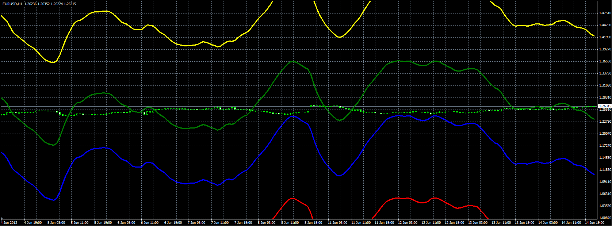

# Wilson Relative Price Channel (WRPC)

> Source: https://fxcodebase.com/code/viewtopic.php?f=38&t=20227  
> Forum: 38 · Topic 20227 · 1 post(s)

---

## Wilson Relative Price Channel (WRPC)

**Alexander.Gettinger** · Fri Jun 15, 2012 3:19 pm

Original indicator: [viewtopic.php?f=17&t=19607&p=34663](https://fxcodebase.com/code/viewtopic.php?f=17&t=19607&p=34663)

Formulas:
OverBought=Price*(1-(MA-OB)/100),
OverSold=Price*(1-(MA-OS)/100),
NeutralUp=Price*(1-(MA-UNZ)/100),
NeutralDown=Price*(1-(MA-LNZ)/100), where
MA - EMA with period [SP] from RSI with period [CP],
Price - Applied price (0 - Close, 1 - Open, 2 - High, 3 - Low, 4 - Median, 5 - Typical, 6 - Weighted).

 

Download:

 [WRPC.mq4](files/35560/WRPC.mq4)
