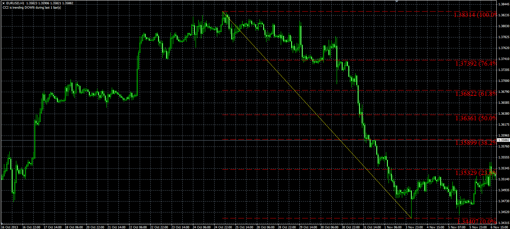
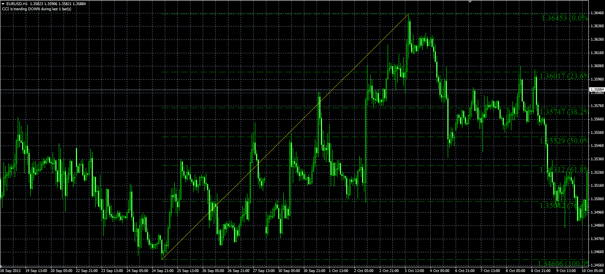

# Window Fibo script

> Source: https://fxcodebase.com/code/viewtopic.php?f=38&t=60047  
> Forum: 38 · Topic 60047 · 6 post(s)

---

## Window Fibo script

**Alexander.Gettinger** · Mon Dec 02, 2013 10:50 am

The script finds the maximum and minimum in the chart window and shows the Fibo levels.

 

 

Download:

 [Window_Fibo.mq4](files/91299/Window_Fibo.mq4)

---

## Re: Window Fibo script

**alspicer** · Thu Jan 02, 2014 6:09 am

is Window Fibo script a SCRIPT or an INDICATOR?

---

## Re: Window Fibo script

**alspicer** · Thu Jan 02, 2014 11:56 am

Ok I figured it out its a script
Thank you

---

## Re: Window Fibo script

**izzatilla** · Thu Jun 19, 2014 10:57 am

thank you Alexander,
there is one proflem - Fibo lines should be fixed and not changed in changing window by my view. It would be better to select one trend by simple method (with compating lows and highs) and draw FIBO by them.

Following is preferable if abovementioned were released.
Please, could you make it an expert advisor, which will put a buylimit order at one of Fibo levels and stop loss and take profit points at other levels. And it will wait for next fibo generation.

Thank you in advance,
Izzat, UZB

---

## Re: Window Fibo script

**Apprentice** · Sat Jun 21, 2014 4:09 am

Your request is added to the development list.

---

## Re: Window Fibo script

**Alexander.Gettinger** · Mon Dec 10, 2018 9:20 pm

Please, try this version of script:

 [Window_Fibo2.mq4](files/122675/Window_Fibo2.mq4)
