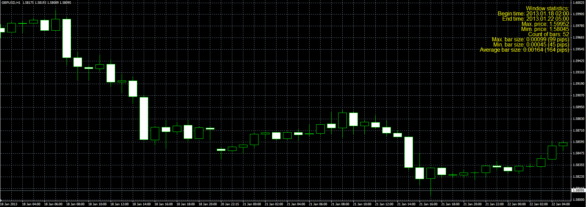

# Window statistics script

> Source: https://fxcodebase.com/code/viewtopic.php?f=38&t=31492  
> Forum: 38 · Topic 31492 · 1 post(s)

---

## Window statistics script

**Alexander.Gettinger** · Mon Jan 28, 2013 5:04 pm

The script calculates:
- begin and end time of chart window
- max. and min. price
- count of bars
- max., min. and average size of bars.

 

Download:

 [WindowStatistics.mq4](files/53723/WindowStatistics.mq4)
