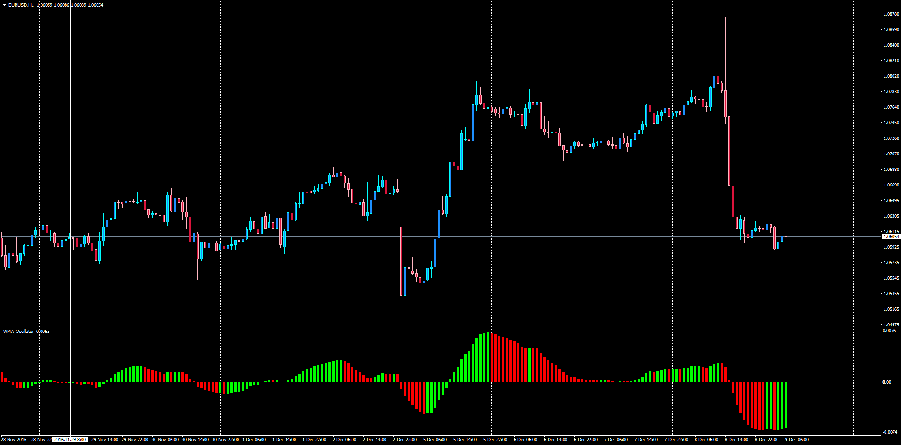

# WMA Oscillator

> Source: https://fxcodebase.com/code/viewtopic.php?f=38&t=64191  
> Forum: 38 · Topic 64191 · 1 post(s)

---

## WMA Oscillator

**Apprentice** · Fri Dec 09, 2016 5:55 am

LUA Original: [viewtopic.php?f=17&t=2615](https://fxcodebase.com/code/viewtopic.php?f=17&t=2615)
Description:
This oscillator will display a histogram following this formula:

WMAO [period] = Wilders MA(5) - Wilders MA(20)

 [WMA_Oscillator.mq4](files/109658/WMA_Oscillator.mq4)
