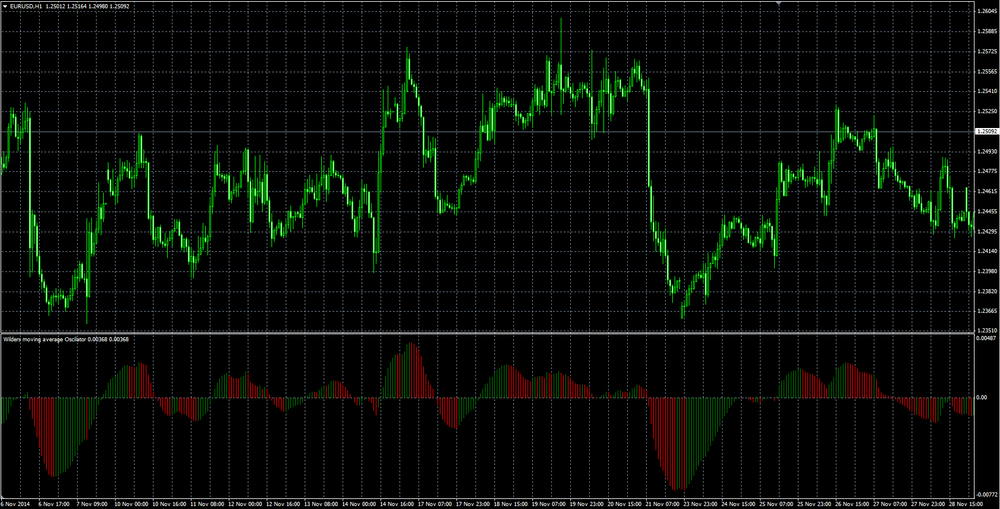

# WMA Oscillator

> Source: https://fxcodebase.com/code/viewtopic.php?f=38&t=61636  
> Forum: 38 · Topic 61636 · 1 post(s)

---

## WMA Oscillator

**Alexander.Gettinger** · Tue Dec 23, 2014 8:41 am

Formula:
WMAO = WMA_S - WMA_L, where
WMA_S = WMA(Price) with [Short_Length] number of periods,
WMA_L = WMA(Price) with [Long_Length] number of periods,
WMA - Wilders smooting average ([viewtopic.php?f=38&t=59621&p=96428](https://fxcodebase.com/code/viewtopic.php?f=38&t=59621&p=96428)).

 

Download:

 [WMAO.mq4](files/97865/WMAO.mq4)

For this indicator must be installed Wilders smooting average ([viewtopic.php?f=38&t=59621&p=96428](https://fxcodebase.com/code/viewtopic.php?f=38&t=59621&p=96428)).
