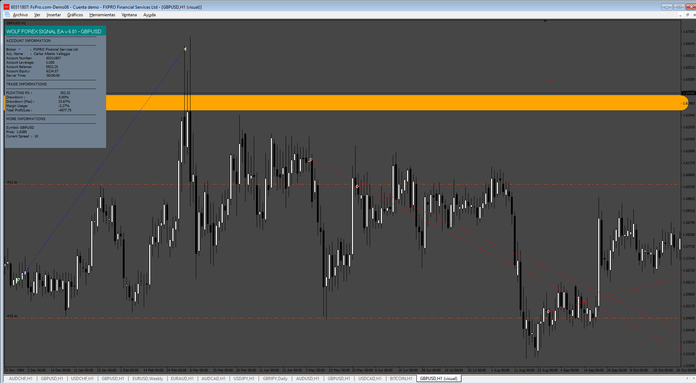

# wolf_forex_signal_ea_v6.01

> Source: https://fxcodebase.com/code/viewtopic.php?f=38&t=75526  
> Forum: 38 · Topic 75526 · 6 post(s)

---

## wolf_forex_signal_ea_v6.01

**Apprentice** · Mon Jan 20, 2025 4:23 pm

 [42642](files/157925/28_compiling_no_warnings.png)

Based on the request.
[https://fxcodebase.com/code/viewtopic.php?f=27&p=157744](https://fxcodebase.com/code/viewtopic.php?f=27&p=157744)

 [wolf_forex_signal_ea_v6.01.mq4](files/157925/wolf_forex_signal_ea_v6.01.mq4)

---

## Re: wolf_forex_signal_ea_v6.01

**linnister** · Wed Jan 22, 2025 8:46 am

Is it possible to have for MT5?

---

## Re: wolf_forex_signal_ea_v6.01

**Apprentice** · Thu Jan 23, 2025 3:19 pm

We have added your request to the development list.
Development reference 51

---

## Re: wolf_forex_signal_ea_v6.01

**Apprentice** · Sat Nov 15, 2025 1:32 pm

[wolf_forex_signal_ea_v6.01.mq5](files/161215/wolf_forex_signal_ea_v6.01.mq5)

---

## Re: wolf_forex_signal_ea_v6.01

**khanatd** · Mon Nov 17, 2025 3:31 am

hi sir , according to indicator conditions it is not showing any alert at all pop up or arrow,thanks khan

---

## Re: wolf_forex_signal_ea_v6.01

**nablito** · Wed Nov 26, 2025 4:20 pm

history reader
