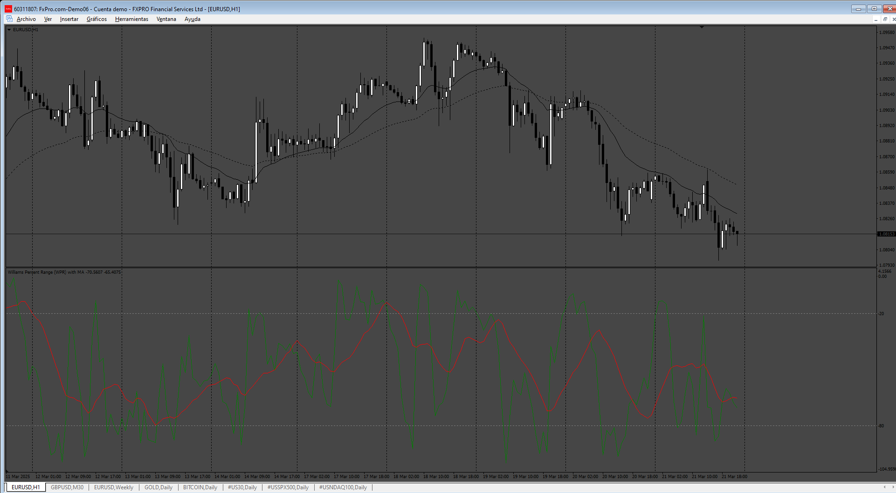

# WPR_Arrows

> Source: https://fxcodebase.com/code/viewtopic.php?f=38&t=75748  
> Forum: 38 · Topic 75748 · 7 post(s)

---

## WPR_Arrows

**Apprentice** · Sun Mar 23, 2025 11:06 am

Based on the request.
[https://fxcodebase.com/code/viewtopic.p ... 99#p158699](https://fxcodebase.com/code/viewtopic.php?f=17&p=158699#p158699)

 [WPR_Arrows.mq4](files/158738/WPR_Arrows.mq4)

---

## Re: WPR_Arrows

**HestoriiafxInc** · Fri Apr 11, 2025 1:59 pm

Sorry for the bother no ObOs arrows appears when the wpr cross below or above 20 and 80 line ..can you add arrows when the wpr crosses below -80 we get a sell and when it cross above -20 we get a buy please

---

## Re: WPR_Arrows

**Apprentice** · Wed Apr 16, 2025 3:19 am

We have added your request to the development list.
Development reference 271

---

## Re: WPR_Arrows

**Apprentice** · Sun Apr 20, 2025 10:42 am

[WPR_Arrows_v2.mq4](files/158997/WPR_Arrows_v2.mq4)

Try this version.

---

## Re: WPR_Arrows

**Teruyoshi** · Fri May 16, 2025 5:34 am

Could you please get rid of button function from this guy?
 Thanks in advance.

---

## Re: WPR_Arrows

**Apprentice** · Sat May 17, 2025 11:03 am

We have added your request to the development list.
Development reference 330

---

## Re: WPR_Arrows

**Apprentice** · Mon May 26, 2025 1:53 pm

[WPR_Arrows_v3.mq4](files/159384/WPR_Arrows_v3.mq4)

Try this version.
