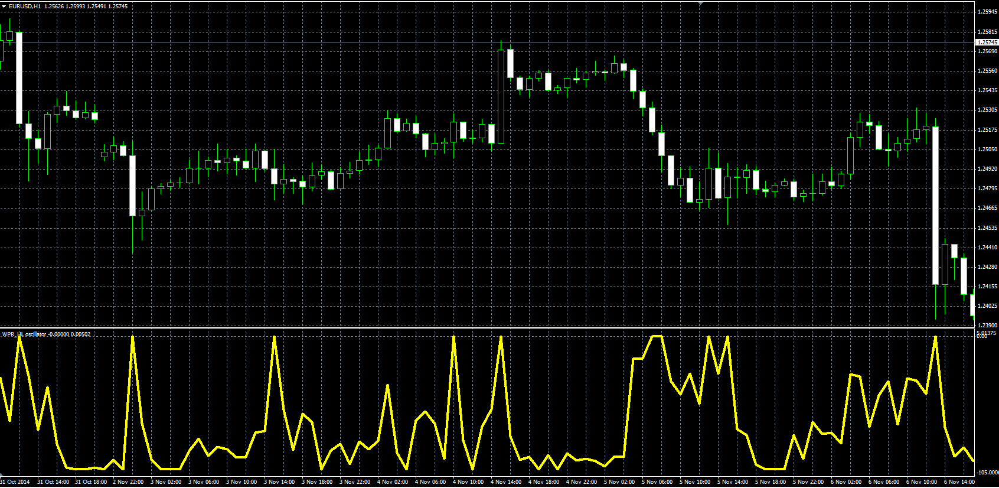

# WPR_HL oscillator

> Source: https://fxcodebase.com/code/viewtopic.php?f=38&t=61493  
> Forum: 38 · Topic 61493 · 1 post(s)

---

## WPR_HL oscillator

**Alexander.Gettinger** · Thu Nov 20, 2014 10:14 am

The oscillator represents the Williams’ Percent Range calculated on the (High-Low).

Formula:
WPR_HL[i]=-100*(Max-HL[i])/(Max-Min), where
HL[i]=High[i]-Low[i],
Max and Min - maximum and minimum prices at range from (i-Period+1) to (i).

 

Download:

 [WPR_HL.mq4](files/97222/WPR_HL.mq4)
