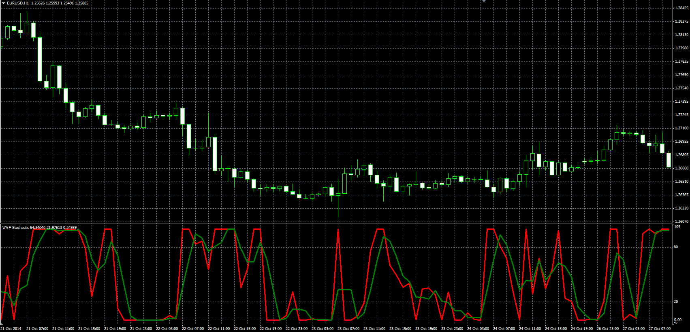

# WVF Stochastic

> Source: https://fxcodebase.com/code/viewtopic.php?f=38&t=61503  
> Forum: 38 · Topic 61503 · 1 post(s)

---

## WVF Stochastic

**Alexander.Gettinger** · Thu Nov 20, 2014 5:59 pm

Original LUA oscillator: [viewtopic.php?f=17&t=6648](https://fxcodebase.com/code/viewtopic.php?f=17&t=6648).

Formulas:
K = 100*mins/maxes,
D = MVA(K) with [Stochastic_D_Length] number of periods, where
mins = WVF - minLow,
maxes = maxHigh - minLow,
minLow, maxHigh - minimum and maximum values of WVF at range from (i-Stochastic_K_Length+1) to (i),
WVF = 100*(Max-Low)/Max,
Max - highest close price at range from (i-WVF_Length+1) to (i).

 

Download:

 [WVF_Stochastic.mq4](files/97241/WVF_Stochastic.mq4)
