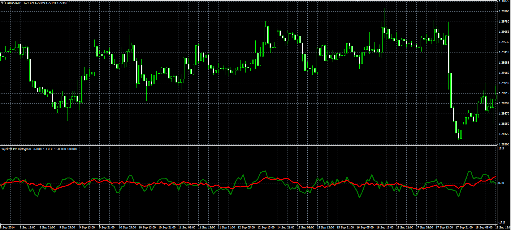

# Wyckoff PV Histogram

> Source: https://fxcodebase.com/code/viewtopic.php?f=38&t=61454  
> Forum: 38 · Topic 61454 · 4 post(s)

---

## Wyckoff PV Histogram

**Alexander.Gettinger** · Mon Nov 17, 2014 5:16 pm

Original LUA oscillator: [viewtopic.php?f=17&t=22630](https://fxcodebase.com/code/viewtopic.php?f=17&t=22630).

 

Download:

 [WPVH.mq4](files/97126/WPVH.mq4)

---

## Re: Wyckoff PV Histogram

**arhamaryan** · Thu Jan 29, 2015 1:32 am

Many thanks for putting up an MT4 version of the .Lua Thrust Bar indicator. Apologies for not having replied earlier but, for some reason, I didn't get notified that there had been a new post on the thread.

I've managed to get the indicator uploaded on to the chart which is good for me. However, can I be a pain and ask if it can to modified to sound an alarm and show a msgbx when the last tick makes the Open/Last Price spread equal to the ATR*Multiplier in real time?

If this can be done it would improve the indicator's usefulness loads as it would mean I don't need to keep on returning to the PC to check to see if there are any Thrust Bars.

---

## Re: Wyckoff PV Histogram

**Apprentice** · Thu Jan 29, 2015 4:20 am

Your request is added to the development list.

---

## Re: Wyckoff PV Histogram

**Alexander.Gettinger** · Fri Dec 14, 2018 4:41 pm

Please try this version of indicator:

 [WPVH_with_Alert.mq4](files/122858/WPVH_with_Alert.mq4)
