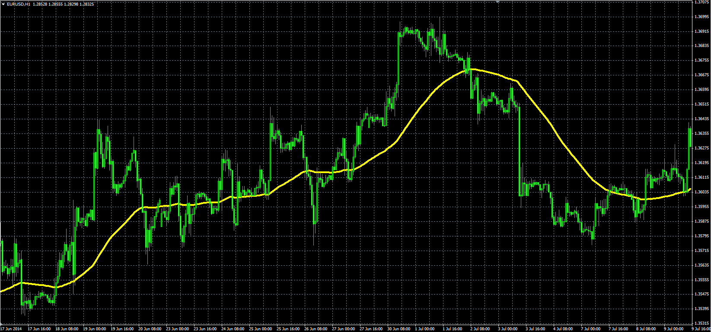

# X MA Sum Average

> Source: https://fxcodebase.com/code/viewtopic.php?f=38&t=61235  
> Forum: 38 · Topic 61235 · 1 post(s)

---

## X MA Sum Average

**Alexander.Gettinger** · Tue Sep 23, 2014 10:46 am

Original LUA indicator: [viewtopic.php?f=17&t=27765](https://fxcodebase.com/code/viewtopic.php?f=17&t=27765).

> XMaSumAvgSum or XMA Averages calculated Average as the average of All moving averages from Start-End Range.

 

Download:

 [xMASumAvg.mq4](files/96134/xMASumAvg.mq4)
