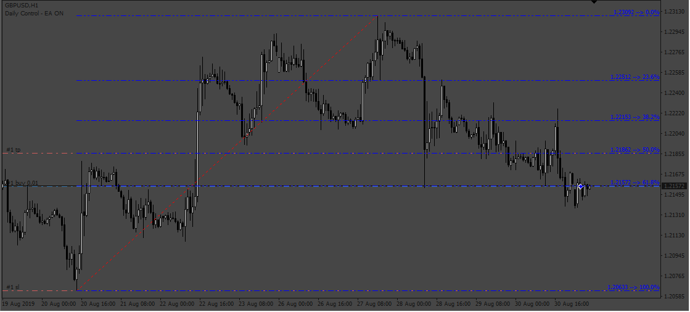
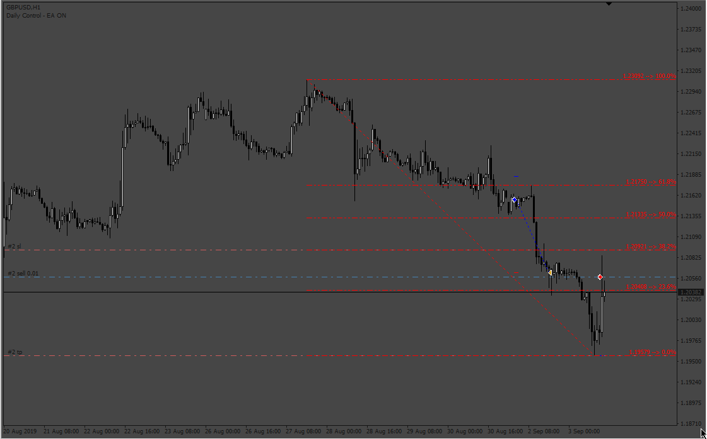

# XIT_FIBS_E

> Source: https://fxcodebase.com/code/viewtopic.php?f=38&t=73027  
> Forum: 38 · Topic 73027 · 8 post(s)

---

## XIT_FIBS_E

**Apprentice** · Sat Dec 10, 2022 5:47 am

 

Based on the request.
[https://fxcodebase.com/code/viewtopic.php?f=27&p=148575](https://fxcodebase.com/code/viewtopic.php?f=27&p=148575)

 [XIT_FIBS_with_Colour.ex4](files/148620/XIT_FIBS_with_Colour.ex4)

 [XIT_FIBS_EA.mq4](files/148620/XIT_FIBS_EA.mq4)

---

## Re: XIT_FIBS_E

**Sensible** · Sat Dec 10, 2022 6:03 pm

Hi Apprentice,

Thanks for working on this EA and quick response.

I am having issue in instilling the EA, it not opening on the chart. This is the message gotten from expert feedback:
2022.12.10 23:15:33.517 cannot open file 'C:\Users\user\AppData\Roaming\MetaQuotes\Terminal\F7F80BF9DDB29D8FD1B0DCD822F7567D\MQL4\Experts\XIT_FIBS_EA.ex4' [2]

Secondly from the diagram I observed that the XIT_FIB EA is opening trade at the Fibonacci retracement of the support and resistance line at 23.6%, & 61.8% rather at the support and resistance line at 0% & 100%.

I prefer XIT_FIB EA to open & close a trade at the reversal of price on the support line and resistance line at the 0% & 100% rather at the Fibonacci retracement of 23.6%, & 61.8%.

Please help me to adjust it to open and close a trade at the 0% & 100%

Thanks

---

## Re: XIT_FIBS_E

**crypto0014** · Sun Dec 11, 2022 3:35 am

Unable to compile. It having errors

---

## Re: XIT_FIBS_E

**Apprentice** · Sun Dec 11, 2022 12:55 pm

We have added your request to the development list.
Development reference 817.

---

## Re: XIT_FIBS_E

**Apprentice** · Sat Jan 14, 2023 3:59 am

Try it now.

---

## Re: XIT_FIBS_E

**crypto0014** · Mon Jan 23, 2023 4:31 am

Its not taking any trades. i even loaded the indicator.

---

## Re: XIT_FIBS_E

**Apprentice** · Mon Jan 23, 2023 11:32 am

We have added your request to the development list.
Development reference 74.

---

## Re: XIT_FIBS_E

**Apprentice** · Wed Feb 01, 2023 1:59 pm

Try it now.
