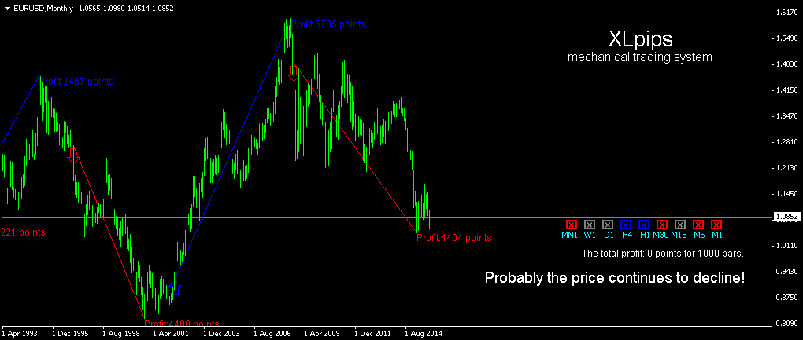
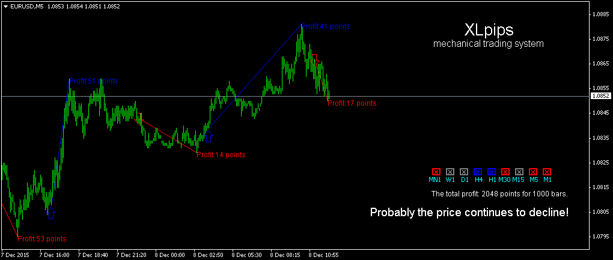

# XLpips

> Source: https://fxcodebase.com/code/viewtopic.php?f=38&t=62952  
> Forum: 38 · Topic 62952 · 5 post(s)

---

## XLpips

**ALeek7777777** · Tue Dec 15, 2015 11:41 am

Download

 [XLpips.ex4](files/103829/XLpips.ex4)

 

 

---

## Re: XLpips

**Apprentice** · Wed Dec 16, 2015 4:34 am

Failed to start your indicator within MT4.
Can you specify, intention behind your post?

---

## Re: XLpips

**miafx666** · Sat Dec 19, 2015 10:41 am

Who is creator of this system, i cant find this EA anywhere on web. This version is not working.

---

## Re: XLpips

**ALeek7777777** · Sun Jan 17, 2016 7:04 am

> **miafx666 wrote:**
> Who is creator of this system, i cant find this EA anywhere on web. This version is not working.

Here there is an indicator [https://www.mql5.com/en/market/product/13198#](https://www.mql5.com/en/market/product/13198)

---

## Re: XLpips

**helloboy** · Tue Jan 19, 2016 4:54 am

demo version. But don't waste your time , it's not an accurate indicator
