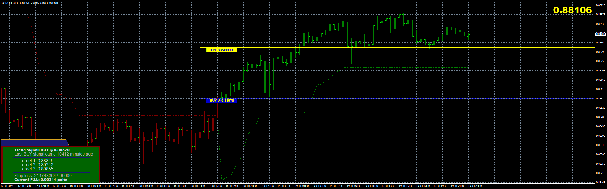
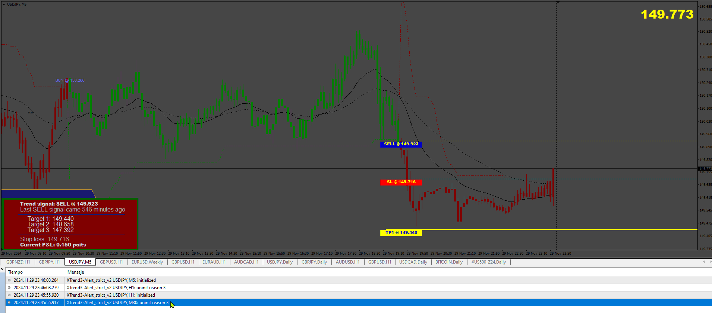

# XTrend3-Alert_strict

> Source: https://fxcodebase.com/code/viewtopic.php?f=38&t=75237  
> Forum: 38 · Topic 75237 · 8 post(s)

---

## XTrend3-Alert_strict

**Apprentice** · Fri Sep 27, 2024 6:37 am

Based on the request.
[https://fxcodebase.com/code/viewtopic.p ... 2&start=10](https://fxcodebase.com/code/viewtopic.php?f=38&t=74972&start=10)

 [XTrend3-Alert_strict.mq4](files/156808/XTrend3-Alert_strict.mq4)

---

## Re: XTrend3-Alert_strict

**rickCreations** · Sat Sep 28, 2024 4:54 am

Code: [Select all](https://fxcodebase.com/code/)
`2024.09.28 17:51:04.103   XTrend3-Alert_strict GBPUSD,H1: array out of range in 'XTrend3-Alert_strict.mq4' (347,12)`

array out of range on the "trend[i]=1; "

Code: [Select all](https://fxcodebase.com/code/)
`//----
   for (i = Bars-100; i >= 0; i--) {
      TrendUp[i] = EMPTY_VALUE;
      TrendDown[i] = EMPTY_VALUE;
      atr = iATR(NULL, 0, Nbr_Periods, i);
      //Print("atr: "+atr[i]);
      medianPrice = (High[i]+Low[i])/2;
      //Print("medianPrice: "+medianPrice[i]);
      up[i]=medianPrice+(Multiplier*atr);
      //Print("up: "+up[i]);
      dn[i]=medianPrice-(Multiplier*atr);
      //Print("dn: "+dn[i]);
      trend[i]=1;`

---

## Re: XTrend3-Alert_strict

**Apprentice** · Tue Oct 01, 2024 5:35 am

We have added your request to the development list.
Development reference 748

---

## Re: XTrend3-Alert_strict

**VuxxLong** · Fri Oct 04, 2024 8:41 pm

Hello Apprentice, could you please convert it to mq5?

---

## Re: XTrend3-Alert_strict

**Apprentice** · Sun Oct 06, 2024 3:44 am

We have added your request to the development list.
Development reference 761

---

## Re: XTrend3-Alert_strict

**rickCreations** · Wed Nov 20, 2024 2:00 pm

still broken.

example. place indicator on chart H1
load indicator.

works fine.

now switch chart to M5

(array out of range) .

---

## Re: XTrend3-Alert_strict

**Apprentice** · Fri Nov 22, 2024 1:06 pm

We have added your request to the development list.
Development reference 860

---

## Re: XTrend3-Alert_strict

**Apprentice** · Sun Dec 01, 2024 5:06 am

 [XTrend3-Alert_strict_v2.mq4](files/157398/XTrend3-Alert_strict_v2.mq4)
