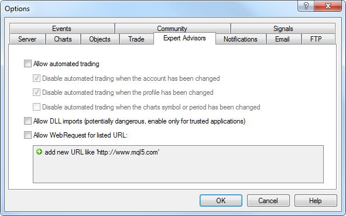

# YBM_Signaller EA

> Source: https://fxcodebase.com/code/viewtopic.php?f=38&t=70642  
> Forum: 38 · Topic 70642 · 34 post(s)

---

## YBM_Signaller EA

**Apprentice** · Thu Nov 19, 2020 3:43 pm

EA uses arrows from the chart, so you need to keep your indicator on the chart.

 [YBM_Signaller.mq5](files/139007/YBM_Signaller.mq5)

 [YBM_Signaller EA.mq5](files/139007/YBM_Signaller%20EA.mq5)

---

## Re: YBM_Signaller EA

**James122583** · Sun Nov 22, 2020 8:19 am

Im just seeing this, my apologies. Also is there anyway to make it for multi-pairs? So that I dont have to set the EA on every chart of the pairs that Im trading?

---

## Re: YBM_Signaller EA

**James122583** · Mon Nov 23, 2020 7:33 am

How am I suppose to but the inputs for the EA in? Set everything up as far as the parameters on the indicator, I have the indicator on the same chart as the EA, but nothing is coming up. I know that I am doing something wrong. Please help?

---

## Re: YBM_Signaller EA

**Apprentice** · Mon Nov 23, 2020 1:49 pm

Your request is added to the development list.
Development reference 2351.

---

## Re: YBM_Signaller EA

**Apprentice** · Wed Nov 25, 2020 11:39 am

You need to put the indicator on the chart as well.
EA looks for arrows drawn by the indicator on the chart.

---

## Re: YBM_Signaller EA

**James122583** · Thu Nov 26, 2020 9:44 am

When, I attach the EA to the chart on one of my computers, "allow modification of signal settings" along with "Allow Algo Trading", but when I try to attach the EA to a chart on a different computer, only "Allow Algo Trading" is shown, and on that computer, I cant get the EA to work correctly. Im not sure what Im doing wrong.

---

## Re: YBM_Signaller EA

**Apprentice** · Sun Nov 29, 2020 3:51 am

It looks like you have two different MT5 terminals.

---

## Re: YBM_Signaller EA

**James122583** · Mon Nov 30, 2020 8:29 am

Oh okay, Thank you, I will look into that

---

## Re: YBM_Signaller EA

**James122583** · Mon Nov 30, 2020 8:30 am

The Ea is working correctly, I only have one problem, I have it set to 1 max trades/max positions, but it has 2 positions open at the same time. They are different pairs, but still 2 open positions even though I have selected only 1 open position. Is there anyway to add max trades allowed? So that I can set how many trades I want traded during the trading time, and possible max trades open at one time input? Thanks for your help

---

## Re: YBM_Signaller EA

**James122583** · Mon Nov 30, 2020 9:05 am

Im also having issues with the EA trading outside of the trading time that I have selected, and also, it has traded pairs that I dont have listed for it to trade

---

## Re: YBM_Signaller EA

**Apprentice** · Mon Nov 30, 2020 10:11 am

Your request is added to the development list.
Development reference 2377.

---

## Re: YBM_Signaller EA

**James122583** · Tue Dec 01, 2020 5:01 am

Ive been testing the EA and it has a few issues, the max trade input doe not work at all, I have it set for 1 trade, and it got into 20 trades last night. The select pair you want the EA to trade input does not work. Also the time doesnt appear to work right either.

---

## Re: YBM_Signaller EA

**Apprentice** · Thu Dec 03, 2020 2:36 pm

Try it now.

---

## Re: YBM_Signaller EA

**James122583** · Fri Dec 04, 2020 9:02 am

I dont see the Ea? Is it somewhere else?

---

## Re: YBM_Signaller EA

**James122583** · Fri Dec 04, 2020 9:48 am

I tried the only EA file could find on this thread, but it doesnt work at all, it wont even allow me to place it on the chart, whenever I try it just disappears

---

## Re: YBM_Signaller EA

**Apprentice** · Fri Dec 04, 2020 1:28 pm

Your request is added to the development list.
Development reference 2399.

---

## Re: YBM_Signaller EA

**Apprentice** · Mon Dec 07, 2020 3:23 am

[YBM_Signaller EA.mq5](files/139356/YBM_Signaller%20EA.mq5)

Try this version.

---

## Re: YBM_Signaller EA

**James122583** · Tue Dec 08, 2020 4:39 am

The EA is showing trade alerts, but is not getting into any trades

---

## Re: YBM_Signaller EA

**tannos** · Wed Dec 09, 2020 3:46 pm

Hi Apprentice,

Can you add martingale option on this EA please.

---

## Re: YBM_Signaller EA

**Apprentice** · Thu Dec 10, 2020 5:37 am

Your request is added to the development list.
Development reference 2425.

---

## Re: YBM_Signaller EA

**Apprentice** · Thu Dec 10, 2020 8:14 am

I don't have any issues. Do you have any errors in the log?

---

## Re: YBM_Signaller EA

**James122583** · Thu Dec 10, 2020 3:10 pm

No issues come up in the log, and I get signals from the Ea, but it wont enter trades, everything is enabled for trading but nothing. What time format is being used? platform time correct?

---

## Re: YBM_Signaller EA

**Apprentice** · Sun Dec 13, 2020 2:16 pm

If it does show an alert then everything works. Check your trading parameters. Is trading allow? Do you have any errors in the log?

---

## Re: YBM_Signaller EA

**James122583** · Mon Dec 14, 2020 1:52 pm

Ive checked and trading is enabled, but still no trades, only trade alerts, but no trades being opened, no errors either

---

## Re: YBM_Signaller EA

**Apprentice** · Tue Dec 15, 2020 11:28 am

Your request is added to the development list.
Development reference 2468.

---

## Re: YBM_Signaller EA

**James122583** · Wed Dec 16, 2020 8:03 am

Im still not getting any tradesopened, Im not sure what Im doing wrong. Everything is enabled, Im getting signals, but no trades opening

---

## Re: YBM_Signaller EA

**James122583** · Wed Dec 16, 2020 8:05 am

Here are my set files for the EA and the indicator, maybe something is wrong there

---

## Re: YBM_Signaller EA

**Apprentice** · Wed Dec 16, 2020 9:50 am

I can't repeat that.
Either there should be an error after the trade was executed either the trading is disabled.

---

## Re: YBM_Signaller EA

**James122583** · Wed Dec 16, 2020 12:03 pm

Well, its neither, Im showing you what is happening. Theres no error, and trading is enabled

---

## Re: YBM_Signaller EA

**Apprentice** · Fri Dec 18, 2020 5:18 am

Your request is added to the development list.
Development reference 2493.

---

## Re: YBM_Signaller EA

**Apprentice** · Sun Dec 20, 2020 9:30 am

There is a dedicated parameter for allowing trading in the EA.
And you need to look for errors on the Experts tab

---

## Re: YBM_Signaller EA

**tannos** · Thu Dec 31, 2020 5:18 am

Hi apprentice,
Did you finished the martingale version of this EA please ([viewtopic.php?f=38&t=70642&start=10#p139426](https://fxcodebase.com/code/viewtopic.php?f=38&t=70642&start=10#p139426))

---

## Re: YBM_Signaller EA

**Apprentice** · Sat Jan 02, 2021 2:41 pm

Your request is added to the development list.
Development reference 3.

---

## Re: YBM_Signaller EA

**Apprentice** · Sun Feb 14, 2021 9:58 am

[YBM_Signaller EA.mq5](files/140733/YBM_Signaller%20EA.mq5)

Try his version.
