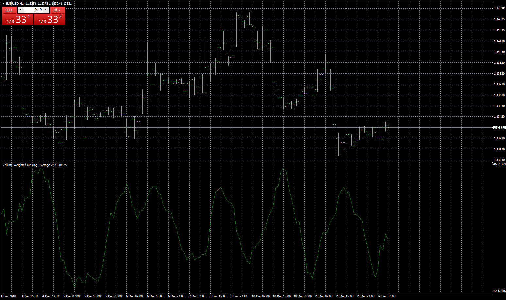
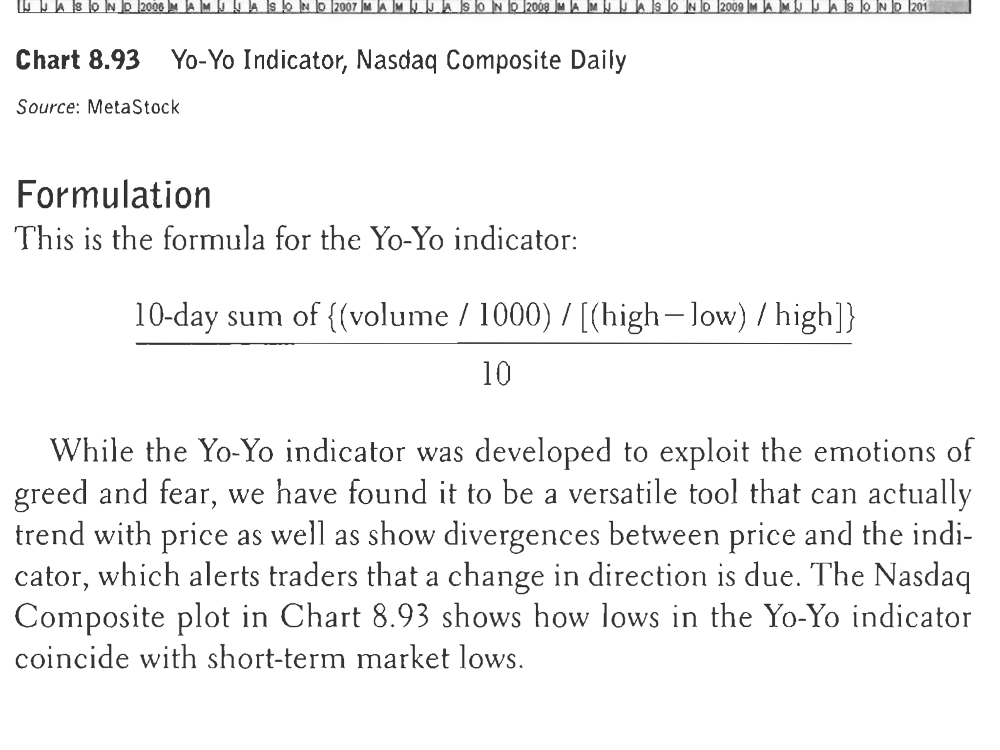
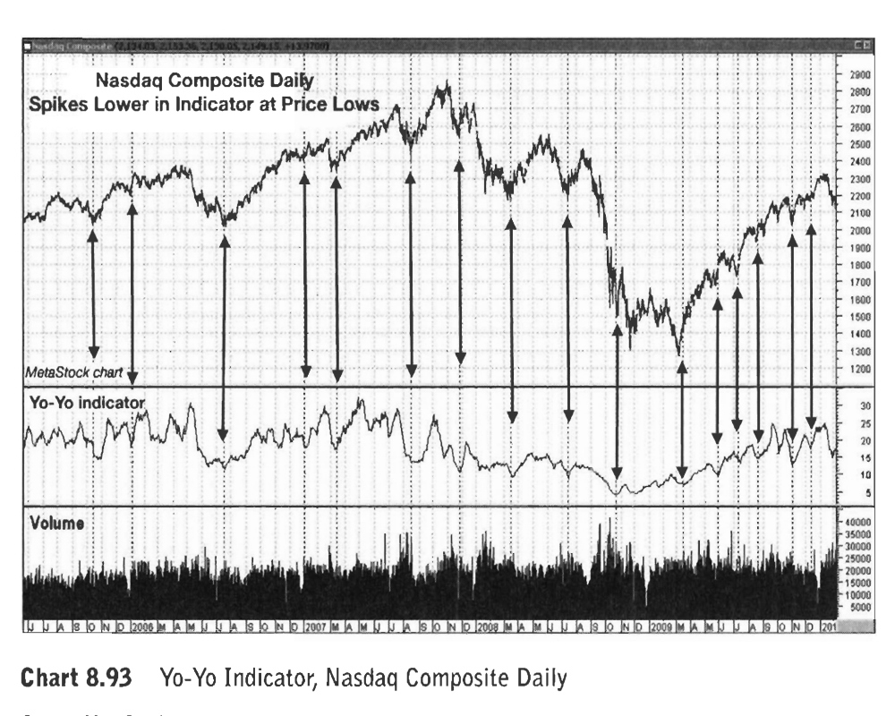

# Yo Yo Indicator

> Source: https://fxcodebase.com/code/viewtopic.php?f=38&t=67148  
> Forum: 38 · Topic 67148 · 10 post(s)

---

## Yo Yo Indicator

**Apprentice** · Wed Dec 12, 2018 8:33 am

 

 

Based on TS2/Lua version
[viewtopic.php?f=17&t=67147](https://fxcodebase.com/code/viewtopic.php?f=17&t=67147)

 [Yo Yo Indicator.mq4](files/122726/Yo%20Yo%20Indicator.mq4)

 [Yo_Yo_Indicator.mq5](files/122726/Yo_Yo_Indicator.mq5)

---

## Re: Yo Yo Indicator

**logicgate** · Wed Dec 12, 2018 11:06 am

Thanks so much brother, God Bless and good trades and profits!

---

## Re: Yo Yo Indicator

**logicgate** · Thu Sep 12, 2019 8:51 pm

Hi there my friend. The indicator is not plotting anything, check the screenshot

---

## Re: Yo Yo Indicator

**Apprentice** · Fri Sep 13, 2019 6:17 am

Fixed. Will work better on the higher time frame.

---

## Re: Yo Yo Indicator

**logicgate** · Fri Sep 13, 2019 8:50 am

Thanks! gonna try it now

---

## Re: Yo Yo Indicator

**logicgate** · Tue Jul 20, 2021 7:03 am

Hi there buddy, can we get a MT5 version of this indicator?

Thanks

---

## Re: Yo Yo Indicator

**Apprentice** · Wed Jul 21, 2021 12:17 am

Your request is added to the development list.
Development reference 668.

---

## Re: Yo Yo Indicator

**Apprentice** · Thu Jul 22, 2021 10:04 am

Yo_Yo_Indicator.mq5 added.

---

## Re: Yo Yo Indicator

**logicgate** · Mon May 22, 2023 4:26 pm

Hi there buddy, can you add an option to invert the indicator plotting? Seems more useful upside down.

---

## Re: Yo Yo Indicator

**Apprentice** · Wed May 24, 2023 8:35 am

We have added your request to the development list.
Development reference 467.
