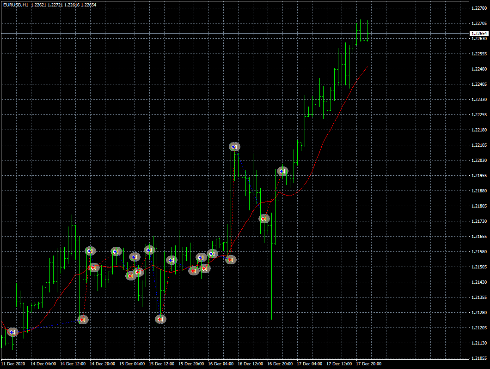

# yolerap EA

> Source: https://fxcodebase.com/code/viewtopic.php?f=38&t=70748  
> Forum: 38 · Topic 70748 · 29 post(s)

---

## yolerap EA

**Apprentice** · Thu Dec 24, 2020 8:58 am

Based on request.
[viewtopic.php?f=27&p=139709#p139709](https://fxcodebase.com/code/viewtopic.php?f=27&p=139709#p139709)

 [yolerap EA.mq4](files/139768/yolerap%20EA.mq4)

 [yolerap_2_EA.mq5](files/139768/yolerap_2_EA.mq5)

---

## Re: yolerap EA

**yolerap** · Sat Dec 26, 2020 11:03 am

Thank you, it's all I wanted !

Please, just add the possibility to open one more position after X candle.

Thank you,

---

## Re: yolerap EA

**Apprentice** · Sun Dec 27, 2020 3:32 pm

Your request is added to the development list.
Development reference 2537.

---

## Re: yolerap EA

**Apprentice** · Mon Dec 28, 2020 3:32 pm

[yolerap EA.mq4](files/139843/yolerap%20EA.mq4)

Try this version.

---

## Re: yolerap EA

**yolerap** · Wed Dec 30, 2020 5:53 am

Sorry but the last update doesn't work ; many positions are opened without respect the X candle.

More, could you add the possibility to close all position which are not profitable after X minutes/hours/days/weeks/months.

Thank you !

---

## Re: yolerap EA

**Apprentice** · Sat Jan 02, 2021 2:42 pm

Your request is added to the development list.
Development reference 4.

---

## Re: yolerap EA

**Apprentice** · Sun Jan 03, 2021 5:48 am

Did you mean that you need to block the opening of new positions during X candles after the last one?

---

## Re: yolerap EA

**yolerap** · Sun Jan 03, 2021 7:07 am

Yes it's correct !

---

## Re: yolerap EA

**Apprentice** · Mon Jan 04, 2021 4:15 am

Your request is added to the development list.
Development reference 21.

---

## Re: yolerap EA

**Apprentice** · Tue Jan 05, 2021 8:48 am

[yolerap EA.mq4](files/140011/yolerap%20EA.mq4)

Try this version.

---

## Re: yolerap EA

**yolerap** · Thu Jan 07, 2021 9:00 am

Thank you boss !

Please, could you add the possibility to close all position which are not profitable after X minutes/hours/days/weeks/months.

---

## Re: yolerap EA

**Apprentice** · Sun Jan 10, 2021 2:16 am

Your request is added to the development list.
Development reference 58.

---

## Re: yolerap EA

**Apprentice** · Tue Jan 12, 2021 10:08 am

[yolerap EA.mq4](files/140175/yolerap%20EA.mq4)

Try this version.

---

## Re: yolerap EA

**SmithAlfred** · Tue Aug 03, 2021 1:48 am

Hello,

I found parameters could be profitable for this strategy but the VPS doesn't allow the .DLL file for migration.

Is it possible to keep all of the strategy parameters but delete all functions which need the .DLL file please ?

Thank you,

Smith.

---

## Re: yolerap EA

**Apprentice** · Wed Aug 04, 2021 4:57 am

Your request is added to the development list.
Development reference 715.

---

## Re: yolerap EA

**Apprentice** · Wed Aug 04, 2021 1:32 pm

[yolerap_EA.mq4](files/143097/yolerap_EA.mq4)

Try this version.

---

## Re: yolerap EA

**SmithAlfred** · Wed Aug 04, 2021 3:46 pm

Many thanks for your answer but I have again the same problem..

I read in the code, line 344 :
" input string Comment4 = "- Install AdvancedNotificationsLib.dll -"

The VPS tell me : No DLL can be used. Install "AdvancedNotificationsLib.dll"

I think the solution is to delete all function needed file .DLL like line 319 to line 376. The VPS won't work with any DLL function.

Could you please correct it ? More, strangely, my presets for the updated strategy are not profitable while it was good for the last .MQ4

Thank you,

---

## Re: yolerap EA

**Apprentice** · Thu Aug 05, 2021 5:30 am

Your request is added to the development list.
Development reference 719.

---

## Re: yolerap EA

**Apprentice** · Thu Aug 05, 2021 2:39 pm

I already removed it

---

## Re: yolerap EA

**SmithAlfred** · Fri Aug 06, 2021 6:16 am

Perfect, thank you it's work.

But in the last update you did, you delete some parameters

First Picture shows the good strategy where nothing is missing.

Second picture shows the last update without .dll but the parameters as shown on the first picture are missing.

Just repair this and it will be so perfect

Thank you,

---

## Re: yolerap EA

**Apprentice** · Fri Aug 06, 2021 12:07 pm

Your request is added to the development list.
Development reference 723.

---

## Re: yolerap EA

**Apprentice** · Mon Aug 09, 2021 8:02 am

[yolerap_2_EA.mq4](files/143155/yolerap_2_EA.mq4)

Try this version.

---

## Re: yolerap EA

**SmithAlfred** · Tue Aug 10, 2021 8:02 am

Perfect ! Thank you !!

---

## Re: yolerap EA

**yolerap** · Thu Sep 23, 2021 7:08 pm

Hello,

Is it possible to add an extra option to the existing ones please?
I would like that as soon as a position is losing, the next one closes at X% in addition to the losing position.
Example: If a position is losing at -100pips (ex: short open at 10000, close at 10100) and I set the new option to 120% -> The TP will be 120pips for the next position (ex: open 10235, TP at 10355)

Thank you for work! I think I'll find good settings with that

---

## Re: yolerap EA

**Apprentice** · Fri Sep 24, 2021 6:30 am

Your request is added to the development list.
Development reference 865.

---

## Re: yolerap EA

**SmithAlfred** · Wed Sep 29, 2021 10:15 am

Hi,

Is someone could translate this version to MT 5 ?

Postby Apprentice » Mon Aug 09, 2021 8:02 am
Yolerap_2_EA.mq4

Regards,

---

## Re: yolerap EA

**Apprentice** · Thu Sep 30, 2021 4:57 am

Your request is added to the development list.
Development reference 880.

---

## Re: yolerap EA

**Apprentice** · Thu Oct 07, 2021 11:42 am

yolerap_2_EA.mq5 added.

---

## Re: yolerap EA

**yolerap** · Tue Nov 16, 2021 7:22 am

Hello,

Please, is it possible to remove the DLL file about this version ?

thank you very much !

Yolerap
