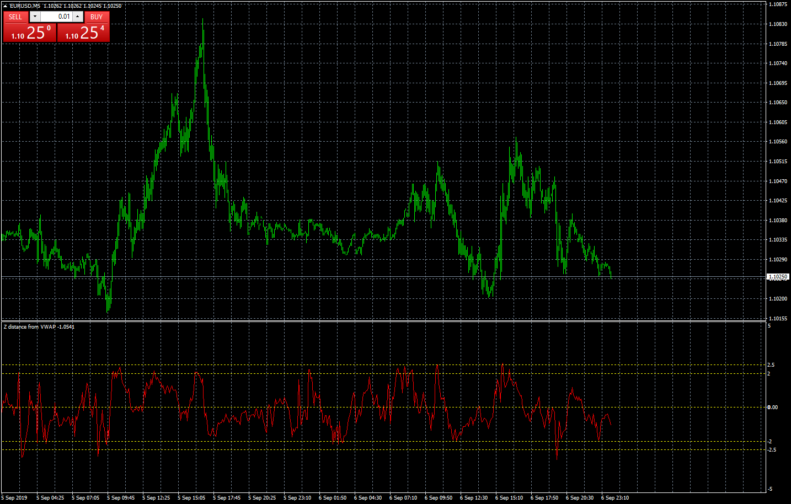
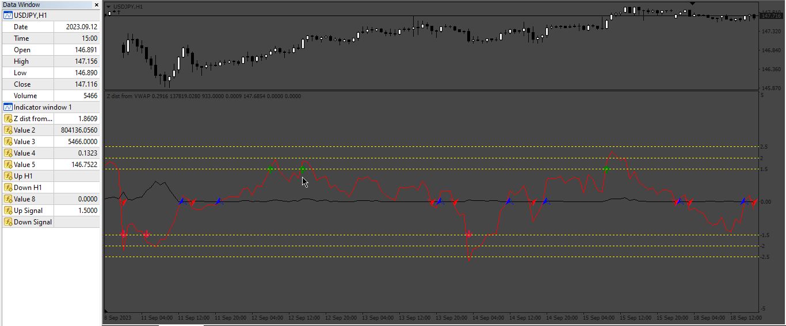

# Z distance from VWAP

> Source: https://fxcodebase.com/code/viewtopic.php?f=38&t=68895  
> Forum: 38 · Topic 68895 · 16 post(s)

---

## Z distance from VWAP

**Apprentice** · Sun Sep 08, 2019 5:13 am

TS2/Lua version.
[viewtopic.php?f=17&t=68887](https://fxcodebase.com/code/viewtopic.php?f=17&t=68887)

 [Z distance from VWAP.mq4](files/128496/Z%20distance%20from%20VWAP.mq4)

---

## Re: Thank you

**aladdin007** · Sun Sep 08, 2019 10:09 am

Thank you

---

## Re: Z distance from VWAP

**amirhosein** · Thu Apr 15, 2021 3:17 am

hello sir
can you add arrow on chart when zero line cross ?
and i look at the code this ind uses sma,can you add more option to it like ema ext ?
I appreciate your help for traders community,peace

---

## Re: Z distance from VWAP

**Apprentice** · Thu Apr 15, 2021 4:58 am

Your request is added to the development list.
Development reference 356.

---

## Re: Z distance from VWAP

**Apprentice** · Sun Apr 18, 2021 2:43 am

[Z_distance_from_VWAP.mq4](files/141555/Z_distance_from_VWAP.mq4)

Try this version.

---

## Re: Z distance from VWAP

**evansrono** · Wed May 11, 2022 5:10 am

Hi,

Please include an MTF feature.

Thanks.

---

## Re: Z distance from VWAP

**Apprentice** · Sat May 14, 2022 11:21 am

To see multiple time frames at once or to have higher time frames?

---

## Re: Z distance from VWAP

**evansrono** · Sat May 14, 2022 1:01 pm

Hi,

To see higher timeframe arrows in lower timeframe, eg See H4,D1,W1,MN arrows in H1 timeframe; each HTF arrow with its own color and size change.

Thanks.

---

## Re: Z distance from VWAP

**Apprentice** · Tue May 17, 2022 1:38 am

We have added your request to the development list.
Development reference 301.

---

## Re: Z distance from VWAP

**IMPawwa** · Thu Aug 18, 2022 3:25 am

Hi,

Can you make this indicator into MT5 version? Thank you

---

## Re: Z distance from VWAP

**Apprentice** · Thu Aug 18, 2022 8:08 am

We have added your request to the development list.
Development reference 494.

---

## Re: Z distance from VWAP

**forexryk** · Fri Sep 08, 2023 3:03 am

> **Apprentice wrote:**
>
>
> Z_distance_from_VWAP.mq4
>
>
> Try this version.

kindly add this function show buy sell signal not on zero level show buy sell signal on
1 or 1.5
-1 or -1.5

thank you in advance.

---

## Re: Z distance from VWAP

**Apprentice** · Sun Sep 10, 2023 2:38 pm

We have added your request to the development list.
Development reference 817.

---

## Re: Z distance from VWAP

**forexryk** · Sun Sep 10, 2023 9:44 pm

> **Apprentice wrote:**
> We have added your request to the development list.
> Development reference 817.

where i can find development reference 817 file

can you send me link here with update function thank you again sir.

---

## Re: Z distance from VWAP

**Apprentice** · Tue Sep 12, 2023 10:48 am

Will be posted here.

---

## Re: Z distance from VWAP

**Apprentice** · Sun Sep 24, 2023 3:48 am

 [Z_distance_from_VWAP_v2.mq4](files/152661/Z_distance_from_VWAP_v2.mq4)
