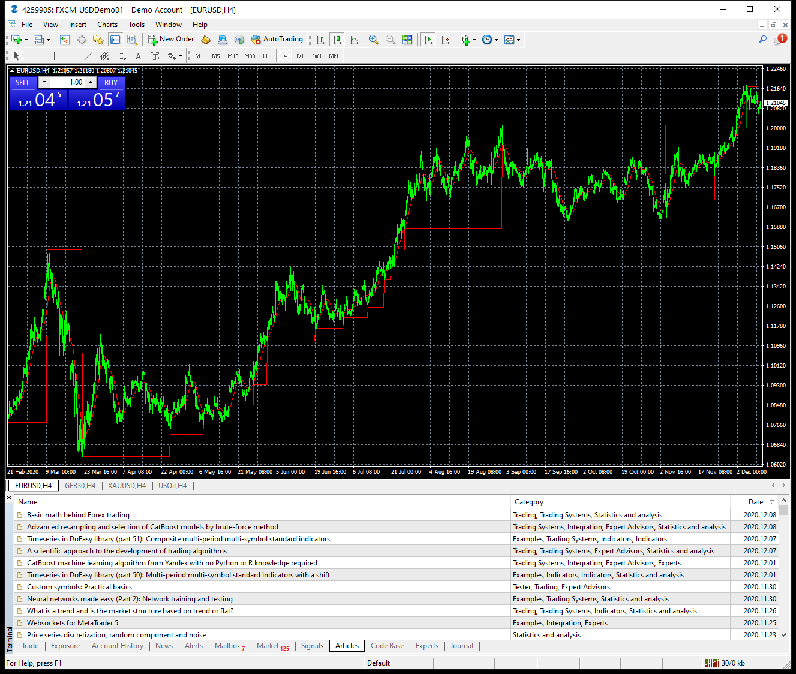

# Zero Balance

> Source: https://fxcodebase.com/code/viewtopic.php?f=38&t=70704  
> Forum: 38 · Topic 70704 · 4 post(s)

---

## Zero Balance

**Apprentice** · Thu Dec 10, 2020 7:55 am

Based on request.
[viewtopic.php?f=27&t=70699](https://fxcodebase.com/code/viewtopic.php?f=27&t=70699)

 [Zero Balance.mq4](files/139439/Zero%20Balance.mq4)

---

## Re: Zero Balance

**yolerap** · Fri Dec 18, 2020 1:57 pm

Hello,

Is it possible to not repaint it or the re-actualise automatically the indicator please ?

Thank you,

---

## Re: Zero Balance

**Apprentice** · Sat Dec 19, 2020 5:10 am

Your request is added to the development list.
Development reference 2501.

---

## Re: Zero Balance

**Apprentice** · Tue Dec 22, 2020 4:40 am

[Zero_Balance.mq4](files/139738/Zero_Balance.mq4)

Try this version.
