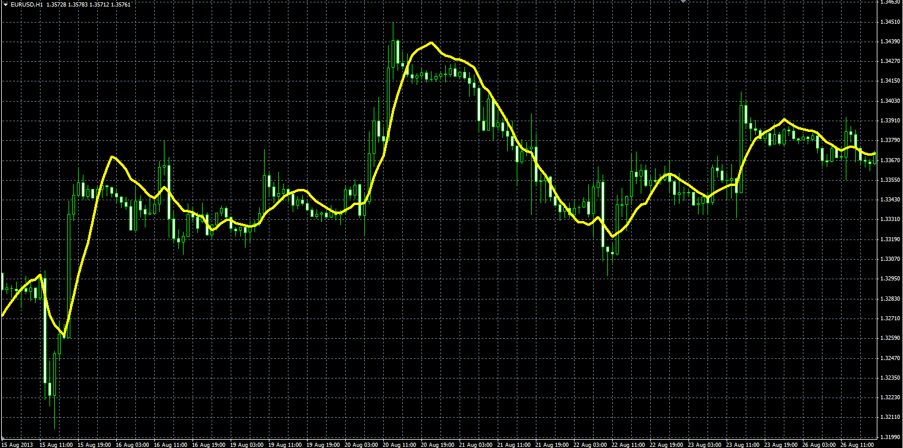

# Zero-Lag Exponential Moving Average

> Source: https://fxcodebase.com/code/viewtopic.php?f=38&t=59634  
> Forum: 38 · Topic 59634 · 2 post(s)

---

## Zero-Lag Exponential Moving Average

**Alexander.Gettinger** · Wed Oct 09, 2013 5:28 pm

Formulas:
ZeroLagEMA[i] = Alpha*(2*Price[i]-Price[i-lag])+(1-Alpha)* ZeroLagEMA[i-1], where
Alpha = 2/(Length+1),
Lag = (Length-1)/2.

 

Download:

 [ZeroLagEMA.mq4](files/89926/ZeroLagEMA.mq4)

---

## Re: Zero-Lag Exponential Moving Average

**Apprentice** · Fri Oct 02, 2015 6:42 am

TS2/Marketscope version can be found here.
[viewtopic.php?f=17&t=62746](https://fxcodebase.com/code/viewtopic.php?f=17&t=62746)
