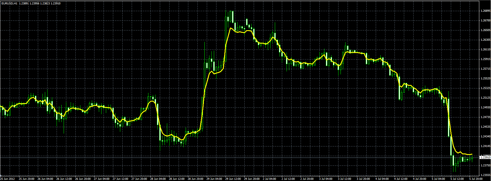

# Zero Lag indicator

> Source: https://fxcodebase.com/code/viewtopic.php?f=38&t=20871  
> Forum: 38 · Topic 20871 · 1 post(s)

---

## Zero Lag indicator

**Alexander.Gettinger** · Thu Jul 05, 2012 4:39 pm

Original indicator: [viewtopic.php?f=17&t=2511](https://fxcodebase.com/code/viewtopic.php?f=17&t=2511)

> Zero Lag indicator is described in November 2010 issue of Stocks & Commodities.
>
> The formula of the indicator is:
> ZL = α * (EMA + Gain * (Close - ZL[1])) + (1 - α) * ZL[1]
>
> The formula is similar to EMA, except that new term Gain * (Close - ZL[1]) is introduced.
> 'Gain' represents the value which is chosen from [-GainLimit, GainLimit] interval to minimize
> the error for current data sample, (Close - ZL) → min

 

Download:

 [ZeroLag.mq4](files/36555/ZeroLag.mq4)
