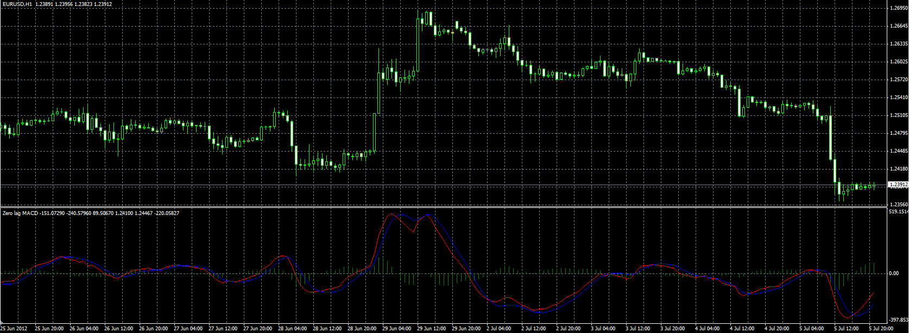

# Zero Lag MACD

> Source: https://fxcodebase.com/code/viewtopic.php?f=38&t=20872  
> Forum: 38 · Topic 20872 · 1 post(s)

---

## Zero Lag MACD

**Alexander.Gettinger** · Thu Jul 05, 2012 4:42 pm

Original indicator: [http://fxcodebase.com/code/viewtopic.ph ... 623&p=3437](https://fxcodebase.com/code/viewtopic.php?f=17&t=1623&p=3437)

> Zero Lag MACD is initially introduced in the Stock & Commodities in 2000.
>
> This version of MACD has much smaller delay in comparison with classic MACD.
>
> Formula:
> MACD = (2 * EMA(price, FAST) - EMA(EMA(price, FAST), FAST)) - (2 * EMA(price, SLOW) - EMA(EMA(price, SLOW), SLOW))
> SIGNAL = 2 * EMA(MACD, SIG) - EMA(EMA(MACD, SIG), SIG))
> HISTOGRAM = MACD - SIGNAL

 

Download:

 [ZeroLagMACD.mq4](files/36557/ZeroLagMACD.mq4)
