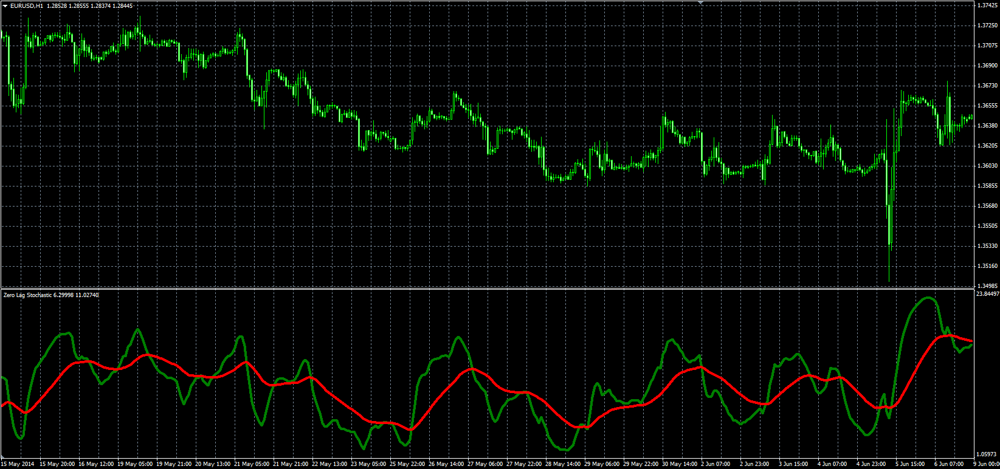

# Zero Lag Stochastic

> Source: https://fxcodebase.com/code/viewtopic.php?f=38&t=61218  
> Forum: 38 · Topic 61218 · 1 post(s)

---

## Zero Lag Stochastic

**Alexander.Gettinger** · Mon Sep 22, 2014 10:57 am

Original LUA oscillator: [viewtopic.php?f=17&t=27932](https://fxcodebase.com/code/viewtopic.php?f=17&t=27932).

Formulas:
K = (S1+S2+S3+S4+S5)/SumWeight,
D[i] = K[i]/Smoothing+D[i-1]*(Smoothing-1)/Smoothing, where
S1 - Stochastic with [K_Length1], [D_Length1], [D_Slowing1], [Method1], [PriceField1],
S2 - Stochastic with [K_Length2], [D_Length2], [D_Slowing2], [Method2], [PriceField2],
S3 - Stochastic with [K_Length3], [D_Length3], [D_Slowing3], [Method3], [PriceField3],
S4 - Stochastic with [K_Length4], [D_Length4], [D_Slowing4], [Method4], [PriceField4],
S5 - Stochastic with [K_Length5], [D_Length5], [D_Slowing5], [Method5], [PriceField5],
SumWeight = Weight1+Weight2+Weight3+Weight4+Weight5.

 

Download:

 [ZLS.mq4](files/96083/ZLS.mq4)
