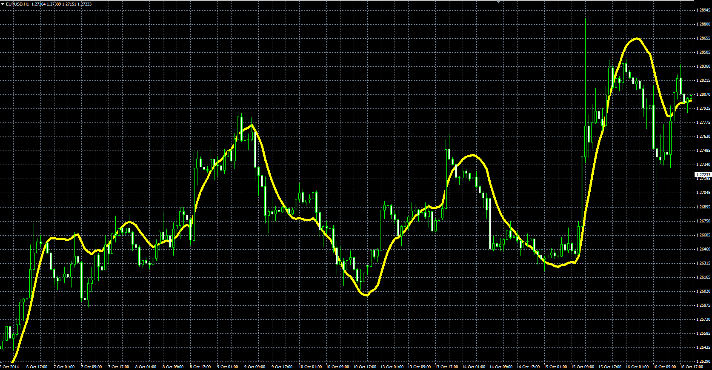

# Zero Lag TEMA

> Source: https://fxcodebase.com/code/viewtopic.php?f=38&t=61383  
> Forum: 38 · Topic 61383 · 1 post(s)

---

## Zero Lag TEMA

**Alexander.Gettinger** · Mon Oct 27, 2014 10:34 am

Original LUA indicator: [viewtopic.php?f=17&t=24108](https://fxcodebase.com/code/viewtopic.php?f=17&t=24108).

Formulas:
Zero Lag TEMA = TEMA1+Diff, where
Diff = TEMA1-TEMA2,
TEMA2 = 3*(EMA4-EMA5)+EMA6,
EMA6 = EMA(EMA5),
EMA5 = EMA(EMA3),
EMA4 = EMA(TEMA1),
TEMA1 = 3*(EMA1-EMA2)+EMA3,
EMA3 = EMA(EMA2),
EMA2 = EMA(EMA1),
EMA1 = EMA(Price),
EMA - exponential moving average with [Length] number of periods.

 

Download:

 [Zero_Lag_TEMA.mq4](files/96755/Zero_Lag_TEMA.mq4)
