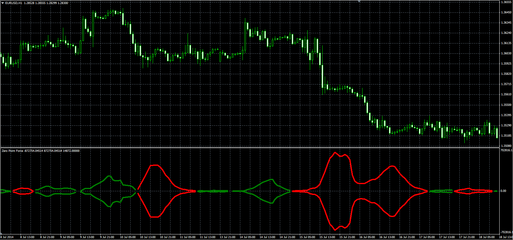

# Zero Point Force

> Source: https://fxcodebase.com/code/viewtopic.php?f=38&t=61234  
> Forum: 38 · Topic 61234 · 1 post(s)

---

## Zero Point Force

**Alexander.Gettinger** · Tue Sep 23, 2014 10:43 am

Original LUA oscillator: [viewtopic.php?f=17&t=27690](https://fxcodebase.com/code/viewtopic.php?f=17&t=27690).

Formula:
ZPF = V*(S-L)/2, where
V = MA(Volume) with [Volume_Length] number of periods and [Volume_Method] type,
S = MA(Close) with [Short_Length] number of periods and [Short_Method] type,
L = MA(Close) with [Long_Length] number of periods and [Long_Method] type.

 

Download:

 [ZPF.mq4](files/96132/ZPF.mq4)
