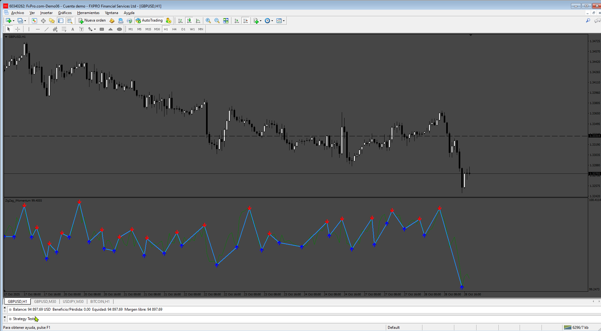

# zig-zag-momentum-candle-indicator

> Source: https://fxcodebase.com/code/viewtopic.php?f=38&t=76248  
> Forum: 38 · Topic 76248 · 4 post(s)

---

## zig-zag-momentum-candle-indicator

**Apprentice** · Mon Aug 18, 2025 11:51 am

 [zig-zag-momentum-candle-indicator.mq4](files/160279/zig-zag-momentum-candle-indicator.mq4)

 [zig-zag-i-momentum.mq4](files/160279/zig-zag-i-momentum.mq4)

---

## Re: zig-zag-momentum-candle-indicator

**khanatd** · Mon Oct 20, 2025 11:55 pm

hi sir plz add mt4 non repaint arrows at close of current candle or reversals/continuations /breakers etc,
i appreciate your good fast service sir

thanks
khan

---

## Re: zig-zag-momentum-candle-indicator

**Apprentice** · Tue Oct 21, 2025 9:42 am

We have added your request to the development list.
Development reference 683

---

## Re: zig-zag-momentum-candle-indicator

**Apprentice** · Wed Oct 29, 2025 5:26 am

 [zig-zag-i-momentum.mq4](files/161070/zig-zag-i-momentum.mq4)
