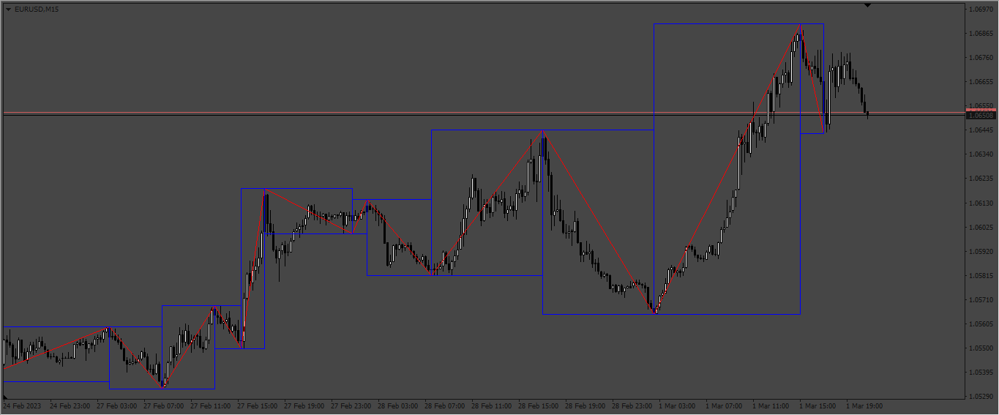
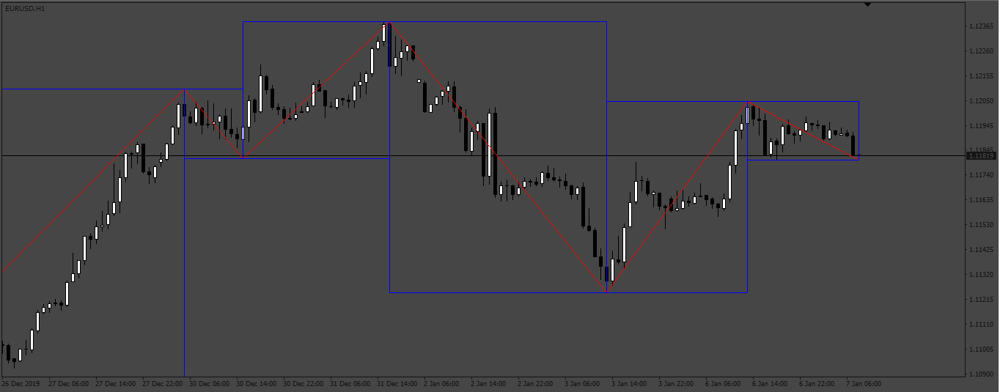

# Zig_Zag_Rectangle

> Source: https://fxcodebase.com/code/viewtopic.php?f=38&t=73459  
> Forum: 38 · Topic 73459 · 4 post(s)

---

## Zig_Zag_Rectangle

**Apprentice** · Sun Mar 05, 2023 6:40 pm

Based on the request.
[https://fxcodebase.com/code/viewtopic.php?f=27&p=149822](https://fxcodebase.com/code/viewtopic.php?f=27&p=149822)

 [Zig_Zag_Rectangle.mq4](files/149883/Zig_Zag_Rectangle.mq4)

---

## Re: Zig_Zag_Rectangle

**EAMONN** · Thu Mar 23, 2023 6:46 am

Hi thank you this is great but could you please place a rectangle also on the last leg that is forming

Cheers

Eamonn.

---

## Re: Zig_Zag_Rectangle

**Apprentice** · Sat Mar 25, 2023 1:18 pm

We have added your request to the development list.
Development reference 271.

---

## Zig_Zag_Rectangle

**Apprentice** · Sat Apr 01, 2023 8:20 am

 [Zig_Zag_Rectangle.mq4](files/150220/Zig_Zag_Rectangle.mq4)
