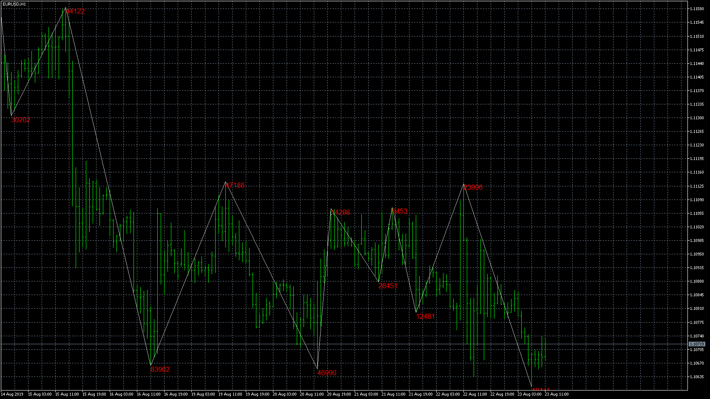

# Zig Zag Wave Volume (MT5)

> Source: https://fxcodebase.com/code/viewtopic.php?f=38&t=68835  
> Forum: 38 · Topic 68835 · 39 post(s)

---

## Zig Zag Wave Volume (MT5)

**Apprentice** · Fri Aug 23, 2019 5:11 am

Based on request.
[viewtopic.php?f=27&t=68814](https://fxcodebase.com/code/viewtopic.php?f=27&t=68814)

 [Zig Zag Wave Volume.mq5](files/128140/Zig%20Zag%20Wave%20Volume.mq5)

---

## Re: Zig Zag Wave Volume (MT5)

**logicgate** · Fri Aug 23, 2019 8:44 am

Thank you, gonna test it and get back to you.

---

## Re: Zig Zag Wave Volume (MT5)

**logicgate** · Fri Aug 23, 2019 11:31 am

Hi there my friend, I think you didn´t understand the request. The code I posted there, you were supposed to use the same code for the zig zag, so it matches the weis wave. This one you posted here it not even loading.

---

## Re: Zig Zag Wave Volume (MT5)

**Apprentice** · Tue Aug 27, 2019 7:24 am

Your request is added to the development list.
 Internal developer reference 8.

---

## Re: Zig Zag Wave Volume (MT5)

**Apprentice** · Tue Sep 03, 2019 5:01 am

Try this version.

 [Zig Zag Wave Volume Oscillator.mq5](files/128381/Zig%20Zag%20Wave%20Volume%20Oscillator.mq5)

---

## Re: Zig Zag Wave Volume (MT5)

**logicgate** · Tue Sep 03, 2019 7:49 am

Thanks my friend, testing it now

---

## Re: Zig Zag Wave Volume (MT5)

**logicgate** · Tue Sep 03, 2019 10:20 am

Hi there buddy.

The colors of the waves are inverted, and the zig zag wave volume still not showing up on chart.

---

## Re: Zig Zag Wave Volume (MT5)

**Apprentice** · Thu Sep 05, 2019 5:32 am

Your request is added to the development list.
Development reference 39.

---

## Re: Zig Zag Wave Volume (MT5)

**Apprentice** · Tue Sep 10, 2019 6:13 am

[Zig Zag Wave Volume Oscillator.mq5](files/128528/Zig%20Zag%20Wave%20Volume%20Oscillator.mq5)

Fixed colors.
You have oscillator version for the histogram and non-oscillator for on-chart drawing.

---

## Re: Zig Zag Wave Volume (MT5)

**peymaan25** · Tue Jan 19, 2021 11:58 am

Goodday
Many thanks for your useful indicator..

---

## Re: Zig Zag Wave Volume (MT5)

**Apprentice** · Thu Jan 21, 2021 3:08 pm

Only one type of volume is available on MT5.

---

## Re: Zig Zag Wave Volume (MT5)

**logicgate** · Sun Jan 24, 2021 3:44 pm

> **Apprentice wrote:**
> Only one type of volume is available on MT5.

Hi there buddy.

You could code another version of this Zig Zag Wave Volume for MT5 but using the code of the indicator I am attaching here.

It gives the up down tick volume difference per bar (a surrogate for delta), so it will give us the delta of each zig zag leg when you sum the values of all bars of the leg.

I would ask please that the volume labels do not include decimal points, instead just make the indicator round the value up or down if above/below .05

---

## Re: Zig Zag Wave Volume (MT5)

**Apprentice** · Sun Jan 24, 2021 6:49 pm

Your request is added to the development list.
Development reference 114.

---

## Re: Zig Zag Wave Volume (MT5)

**peymaan25** · Tue Jan 26, 2021 3:35 am

And also Is it possible to add an option of calculating average zig-zag leg volume as well?
Kind Regards

---

## Re: Zig Zag Wave Volume (MT5)

**logicgate** · Thu Jan 28, 2021 5:01 pm

Dear friend Apprentice, I was able to get the source code of the ZigZag ticks volume difference for MT4, I thought you would like to have a look at it while coding the MT5 version requested.

The only problem with this one I see so far is that it has decimals on the volume labels, and the color of the labels seems to be hard coded because you can´t change it even in indicator settings.

---

## Re: Zig Zag Wave Volume (MT5)

**logicgate** · Sun Feb 14, 2021 5:18 pm

Hi there buddy,

Regarding development reference 114:

I would like that you add an extra option in indicator settings for the type of volume being
used in calculation: tick or real

I am saying this cause I will open a futures account in a broker that offers MT5.

---

## Re: Zig Zag Wave Volume (MT5)

**logicgate** · Thu Mar 04, 2021 5:33 am

Hi there dear friend Apprentice,

Just checking if you haven´t forgotten about this, because you did not even confirm the last request to add the option to use real volume (when available) to the indicator.

Best regards

---

## Re: Zig Zag Wave Volume (MT5)

**logicgate** · Mon Apr 05, 2021 12:24 pm

hi there buddy, any news on this front here?

---

## Re: Zig Zag Wave Volume (MT5)

**logicgate** · Tue Apr 13, 2021 5:00 pm

Dear friend Apprentice, can you please give me an ETA for this? It is the only MT5 indicator I need to fully migrate to the platform and it is an important for my trading, at the moment I am having to check MT4 for the values, and I am not being able to see the values with real volume offered by MT5.

Best regards

---

## Re: Zig Zag Wave Volume (MT5)

**logicgate** · Tue Apr 13, 2021 5:03 pm

You don´t even need to code the whole indicator from scratch, just add the option to use real volume on the indicator posted in the 1st post of this thread.

Option to choose tick volume or real volume (when available).

---

## Re: Zig Zag Wave Volume (MT5)

**logicgate** · Tue Apr 13, 2021 5:09 pm

Actually disregard my last post, I did not think properly.

Actually just adding the option of real volume to the indicator on the OP won´t work as I Want because it will just sum the volume of the waves, and I want the delta.

What is needed is for the indicator subtract the ask from bid on the tick flags for the real delta when using real volume option.

---

## Re: Zig Zag Wave Volume (MT5)

**Apprentice** · Mon Apr 19, 2021 2:37 am

[ZZDSV.mq4](files/141580/ZZDSV.mq4)

Try this version.

---

## Re: Zig Zag Wave Volume (MT5)

**logicgate** · Tue Apr 20, 2021 8:32 am

Hi there buddy, that is for MT4, the request was for MT5

---

## Re: Zig Zag Wave Volume (MT5)

**Apprentice** · Wed Apr 21, 2021 11:48 am

I don't have TSVDiff for MT5.

---

## Re: Zig Zag Wave Volume (MT5)

**logicgate** · Wed Apr 21, 2021 6:13 pm

> **Apprentice wrote:**
> I don't have TSVDiff for MT5.

Well you could convert it...

---

## Re: Zig Zag Wave Volume (MT5)

**AMIT PANDEY** · Wed May 19, 2021 2:52 pm

> **Apprentice wrote:**
>
>
> Zig Zag Wave Volume Oscillator.mq5
>
>
> Fixed colors.
> You have oscillator version for the histogram and non-oscillator for on-chart drawing.

its lagging the volume bar it indicate continues on the same color and doesnt even change and doesnt show the actual wave until it refreshed pls can u fix it if u want to see whats the error just run it on the mt5 strategy tester u will get what im saying

---

## Re: Zig Zag Wave Volume (MT5)

**AMIT PANDEY** · Mon May 24, 2021 5:10 pm

> **AMIT PANDEY wrote:**
>
>
> > **Apprentice wrote:**
> >
> >
> > Zig Zag Wave Volume Oscillator.mq5
> >
> >
> > Fixed colors.
> > You have oscillator version for the histogram and non-oscillator for on-chart drawing.
>
>
>
> its lagging the volume bar it indicate continues on the same color and doesnt even change and doesnt show the actual wave until it refreshed pls can u fix it if u want to see whats the error just run it on the mt5 strategy tester u will get what im saying

Any update?

---

## Re: Zig Zag Wave Volume (MT5)

**peymaan25** · Mon Sep 20, 2021 5:43 am

**Hi..
Could you please change the formula in a way to show average volume of the zig-zag leg instead of cumulative volume ?
Thanks**

---

## Re: Zig Zag Wave Volume (MT5)

**Apprentice** · Tue Sep 21, 2021 3:08 am

Your request is added to the development list.
Development reference 855.

---

## Re: Zig Zag Wave Volume (MT5)

**Apprentice** · Wed Sep 22, 2021 3:54 am

[Zig_Zag_Wave_Volume_Oscillator.mq5](files/143705/Zig_Zag_Wave_Volume_Oscillator.mq5)

Try this version.

---

## Re: Zig Zag Wave Volume (MT5)

**peymaan25** · Wed Sep 22, 2021 7:45 am

Hi
Thanks for your effort but it seems it calculates the average wrongly.
I have attached an screenshot for a simple scenario which the up leg has only 3 bars ( accumulative volume is shown also which is around 98m).I used the oscillator in both cumulative and average which is shown.
the upper one is showing the average=23943127 which is wrong and it should be 32999224 [=(98997672)/3]
Br

---

## Re: Zig Zag Wave Volume (MT5)

**peymaan25** · Wed Sep 29, 2021 7:13 am

> **Apprentice wrote:**
>
>
> Zig_Zag_Wave_Volume_Oscillator.mq5
>
>
> Try this version.

Thanks ..But it seems it does not calculate the average correctly. I have explained it the above.

---

## Re: Zig Zag Wave Volume (MT5)

**johnere** · Sun Oct 17, 2021 6:57 pm

> **Apprentice wrote:**
> Try this version.
>
>
> Zig Zag Wave Volume Oscillator.mq5

Hi, could you please do a version of mql4 or mqh4?

Thanks in advance

---

## Re: Zig Zag Wave Volume (MT5)

**johnere** · Wed Oct 20, 2021 2:31 am

Could you please do a MT4 version for this indicator?

Thanks in advance

---

## Re: Zig Zag Wave Volume (MT5)

**Apprentice** · Wed Oct 20, 2021 6:04 am

Your request is added to the development list.
Development reference 923.

---

## Re: Zig Zag Wave Volume (MT5)

**peymaan25** · Fri Jan 21, 2022 2:41 pm

could anybody update the topic ?

---

## Re: Zig Zag Wave Volume (MT5)

**peymaan25** · Sun Jan 23, 2022 10:44 am

Hi everyone ..
does anybody know how to correct the indicator in a way it divides the volume into the number of candles correctly...the one which is provided here does not calculate it correctly.
Br

---

## Re: Zig Zag Wave Volume (MT5)

**jjmmbb** · Wed Oct 25, 2023 3:45 pm

Dear users,

This is a fantastic indicator for MT5, but unfortunatelly it's being stop working after a time. The waves come with the same color, like this:

So I have to change time frame and then change it back to the original time to get it displaying the correct information:

Anyone knows how to fix it?

---

## Re: Zig Zag Wave Volume (MT5)

**Apprentice** · Thu Oct 26, 2023 2:09 am

Can you repost the images?
