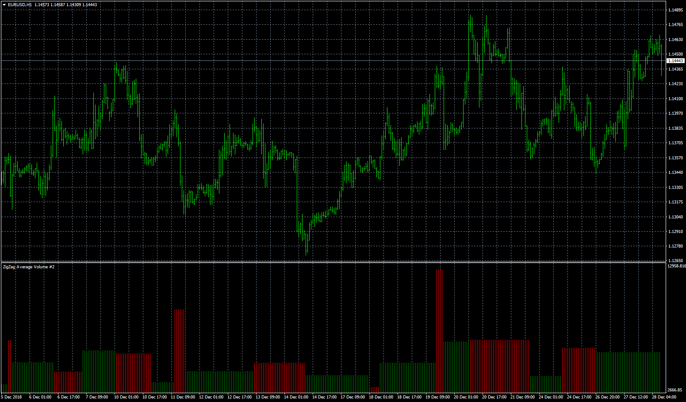

# ZigZag Average Volume

> Source: https://fxcodebase.com/code/viewtopic.php?f=38&t=67212  
> Forum: 38 · Topic 67212 · 16 post(s)

---

## ZigZag Average Volume

**Apprentice** · Fri Dec 28, 2018 6:20 am

 [ZigZag Average Volume.mq4](files/123065/ZigZag%20Average%20Volume.mq4)

TS2/Lua version.
[viewtopic.php?f=17&t=64976](https://fxcodebase.com/code/viewtopic.php?f=17&t=64976)

---

## Re: ZigZag Average Volume

**logicgate** · Fri Dec 28, 2018 1:59 pm

Thanks so much my friend!

---

## Re: ZigZag Average Volume

**logicgate** · Fri Oct 04, 2019 9:32 am

Hello dear friend. Can you code a zigzag delta volume using the code from the TicksSeparateVolume I will attach here?

It can be only the zigzag on top of price and the delta as numerical volume on the pivots, no need to have a subwindow with waves plotted.

The indicator would sum the TicksSeparateVolume value for each bar of the leg and then display the net value on the pivots.

Use the code of the Weis Wave for the zigzag building so we can choose the color of the up leg and down leg (if you use a zigzag indicator then it builds as a single entity and we can´t choose the color of the legs), and using the Weis Wave code we have only one input for the size of the waves (that "Diff" input), which is better.

Add an option to displace the volume label vertically, in small increments, so it won´t overlap with other stuff that might be loaded there.

Thanks!!

---

## Re: ZigZag Average Volume

**logicgate** · Fri Oct 04, 2019 9:34 am

In fact, you could code another version of ZigZag Delta Volume using the code from Cumulative Volume 1.2 so we can experiment and compare which one gives the better values.

---

## Re: ZigZag Average Volume

**Apprentice** · Wed Oct 09, 2019 10:59 am

Your request is added to the development list.
Development reference 161.

---

## Re: ZigZag Average Volume

**logicgate** · Thu Oct 10, 2019 4:04 pm

Hi there buddy, tried to test it now, I am getting an error message saying "install cumulative volume v1.3" but it is already there on the indicator folder so, don´t know why this is happening.

Also, I would like to try the version using the code from TicksSeparateVolumeDif V2 posted here as well.

---

## Re: ZigZag Average Volume

**Apprentice** · Fri Oct 11, 2019 10:13 am

Your request is added to the development list.
Development reference 181.

---

## Re: ZigZag Average Volume

**Apprentice** · Mon Oct 14, 2019 5:25 am

[ZigZag_Average_Cumulative_Volume.mq4](files/129187/ZigZag_Average_Cumulative_Volume.mq4)

Can't repeat (but I've found another bug). Make sure that the indicator name is exactly like expected and compiled.

---

## Re: ZigZag Average Volume

**logicgate** · Mon Oct 14, 2019 4:56 pm

Hi there buddy, I removed a "_" so the name was identical to the one the indicator was asking and it worked.

But you have done the opposite of the request. I asked:

**"It can be only the zigzag on top of price and the delta as numerical volume on the pivots, no need to have a subwindow with waves plotted."**

I only wanted to see the numerical values, like in the weis wave statistics, but without the subwindow showing a histogram.

Also, please code another version using the code from TicksSeparateVolumeDif that I will attach here, it already gives you positive and negative values for each bar, you just got to add the total of each leg to show the net value on the pivots.

---

## Re: ZigZag Average Volume

**logicgate** · Mon Oct 14, 2019 5:00 pm

I am sorry I just forgot to ask you to add an option to choose the color and size of the font (used to display the numerical values), and an option to displace those values vertically, just make sure that if the value is above a pivot it will be displaced upwards and if the value is below a pivot it will be displaced downwards. Thanks

---

## Re: ZigZag Average Volume

**logicgate** · Mon Oct 14, 2019 9:13 pm

Just so you know, it is not the average volume that we want, is the net volume. Just wanted to make sure that the indicator is not applying a division of the value of the leg by the number of bars of the leg.

For example, if a leg have 5 bars and the value of the bars are 10, 30, -10, -15, 40 we gonna have a total of 55 for the leg, it shouldn´t be divided by 5, that would give us 11, it is not the value we wanna see when checking the delta.

---

## Re: ZigZag Average Volume

**Apprentice** · Wed Oct 16, 2019 8:50 am

Try this version.

 [ZigZag_Cumulative_Volume.mq4](files/129253/ZigZag_Cumulative_Volume.mq4)

---

## Re: ZigZag Average Volume

**logicgate** · Wed Oct 16, 2019 11:03 am

Thanks buddy, but again you made the indicator not as requested, we wanna see the zigzag on top of price and volume as numerical value, like the screenshot attached here. Please use the code of the indicator posted on the last post **TicksSeparateVolumeDif** to calculate the delta, it already gives you the positive and negative values for each bar, you just need to sum the values to get the net value of the leg.

Can you use the code of the weis wave to do it? The options on this indicator are not goot. Check the screenshot attached, you could make a version of your weis wave RM4 but using only the zigzag, not the waves plotted on the subwindow (you can leave it out of the code), call it Weis Wave ZigZag. Then it would look like in the screenshot, only the zigzag on top of price with volume information, and the indicator will already have the options for font color, size, label shift... And it is way easier to use when we only need to change one input parameter to change the zigzag

---

## Re: ZigZag Average Volume

**logicgate** · Wed Oct 23, 2019 2:55 pm

Just checking if you are looking into this, thanks mate

---

## Re: ZigZag Average Volume

**Apprentice** · Wed Oct 30, 2019 10:16 am

Your request is added to the development list.
Development reference 265.

---

## Re: ZigZag Average Volume

**Apprentice** · Tue Nov 12, 2019 5:43 am

[ZigZag_Cumulative_Volume.mq4](files/129695/ZigZag_Cumulative_Volume.mq4)

Try this version.
