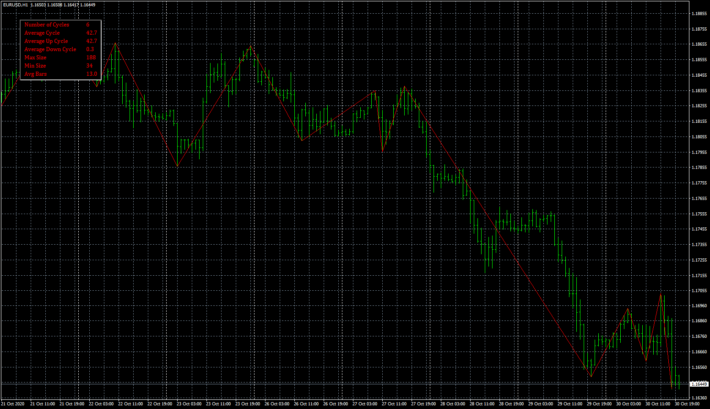

# ZigZag Cycle Info

> Source: https://fxcodebase.com/code/viewtopic.php?f=38&t=70604  
> Forum: 38 · Topic 70604 · 1 post(s)

---

## ZigZag Cycle Info

**Apprentice** · Sun Nov 08, 2020 11:09 am

TS2 version.
[viewtopic.php?f=17&t=66279](https://fxcodebase.com/code/viewtopic.php?f=17&t=66279)

 [ZigZag Cycle Info.mq4](files/138747/ZigZag%20Cycle%20Info.mq4)
