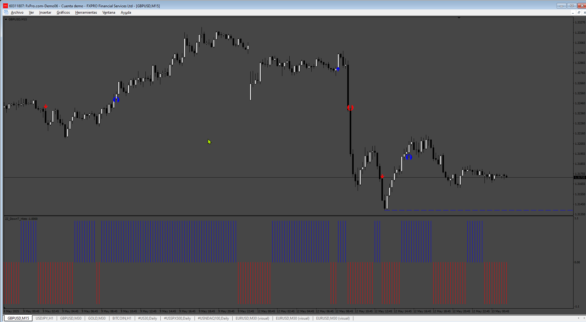
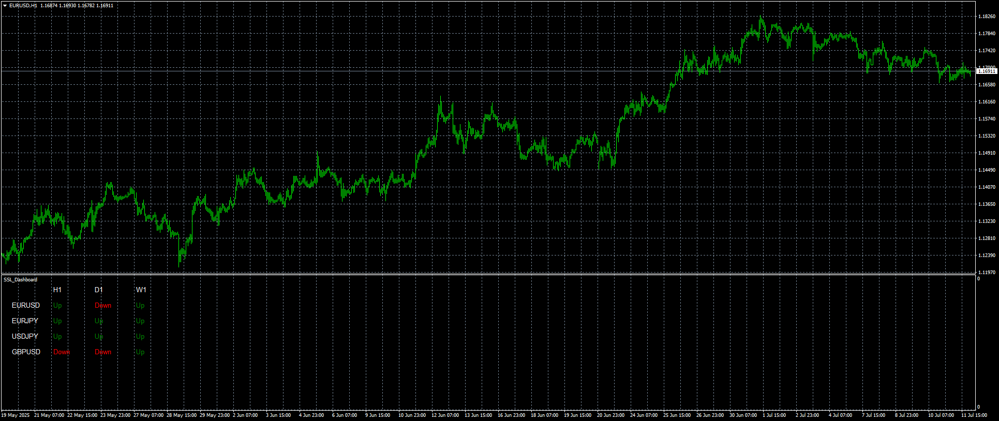

# ZigZag_DowT_DASHBOARD

> Source: https://fxcodebase.com/code/viewtopic.php?f=38&t=75500  
> Forum: 38 · Topic 75500 · 7 post(s)

---

## ZigZag_DowT_DASHBOARD

**Apprentice** · Wed Jan 15, 2025 5:03 am

Based on the request.
[https://fxcodebase.com/code/viewtopic.php?f=38&t=75176](https://fxcodebase.com/code/viewtopic.php?f=38&t=75176)

 [ZigZag_DowT.mq4](files/157819/ZigZag_DowT.mq4)

 [ZigZag_DowT_DASHBOARD.mq4](files/157819/ZigZag_DowT_DASHBOARD.mq4)

---

## Re: ZigZag_DowT_DASHBOARD

**rose123** · Sat Feb 15, 2025 11:37 pm

hi apprendice,

can u create histogram indicator based on zig zag dow T indicator for trading station

based on following conditions:

conditions for buy ful fulled ---- histo gram value is 1

condition for sell fulfilled---- histo gram value is -1

thank you.

---

## Re: ZigZag_DowT_DASHBOARD

**Apprentice** · Mon Feb 17, 2025 1:21 pm

We have added your request to the development list.
Development reference 119

---

## Re: ZigZag_DowT_DASHBOARD

**Apprentice** · Tue May 13, 2025 3:34 am

 [ZigZag_DowT.mq4](files/159216/ZigZag_DowT.mq4)

 [ZZ_DownT_Histo.mq4](files/159216/ZZ_DownT_Histo.mq4)

---

## Re: ZigZag_DowT_DASHBOARD

**Teruyoshi** · Fri Jul 11, 2025 2:17 am

Is it possible to make zigzag_DowT which is not based on zigzag but on gann hilo or ssl?
many thanks in advance.

---

## Re: ZigZag_DowT_DASHBOARD

**Apprentice** · Sun Jul 13, 2025 3:30 am

We have added your request to the development list.
Development reference 450

---

## Re: ZigZag_DowT_DASHBOARD

**Apprentice** · Sun Jul 13, 2025 1:16 pm

 [SSL.mq4](files/159902/SSL.mq4)

 [SSL_Dashboard.mq4](files/159902/SSL_Dashboard.mq4)

 [hilo-activator-profi.mq4](files/159902/hilo-activator-profi.mq4)

 [hilo-activator-profi_Dashboard.mq4](files/159902/hilo-activator-profi_Dashboard.mq4)
