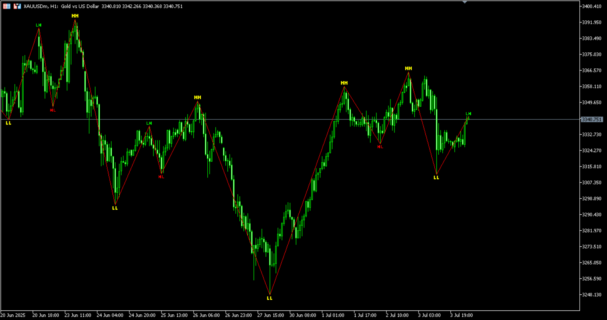
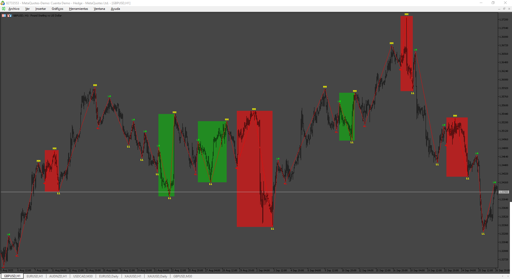
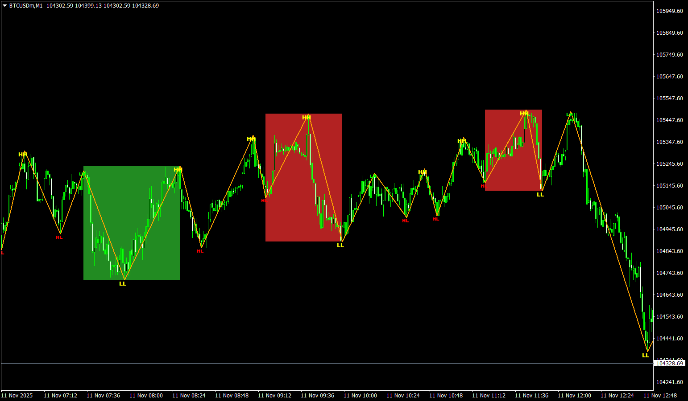

# ZigZag_HH-HL-LH-LL_B

> Source: https://fxcodebase.com/code/viewtopic.php?f=38&t=76157  
> Forum: 38 · Topic 76157 · 8 post(s)

---

## ZigZag_HH-HL-LH-LL_B

**Apprentice** · Wed Jul 16, 2025 3:19 am

Based on the request.
[https://fxcodebase.com/code/viewtopic.p ... 36#p145736](https://fxcodebase.com/code/viewtopic.php?f=27&p=145736#p145736)

 [ZigZag_HH-HL-LH-LL_B.mq5](files/159931/ZigZag_HH-HL-LH-LL_B.mq5)

---

## Re: ZigZag_HH-HL-LH-LL_B

**marcelo2k9** · Sat Sep 20, 2025 11:31 am

Please Mr apprentice, can u edit this indicator for me, when ever HL-HH-LL is formed, let a box be formed around the setup, LH-LL-HH that is when it breaks out of both the support and resistance, then when it forms a LH-HL-LH let a box be formed around the setup and vis vasa... thanks alot

---

## Re: ZigZag_HH-HL-LH-LL_B

**Apprentice** · Tue Sep 23, 2025 3:14 am

We have added your request to the development list.
Development reference 600

---

## Re: ZigZag_HH-HL-LH-LL_B

**Apprentice** · Sat Sep 27, 2025 4:08 pm

 [ZigZag_HH-HL-LH-LL_B_v2.mq5](files/160645/ZigZag_HH-HL-LH-LL_B_v2.mq5)

---

## Re: ZigZag_HH-HL-LH-LL_B

**marcelo2k9** · Thu Nov 06, 2025 2:39 pm

Please Sir, can help us make the mt4 version of this indicator ? It's wonderful

---

## Re: ZigZag_HH-HL-LH-LL_B

**Apprentice** · Sun Nov 09, 2025 8:07 am

We have added your request to the development list.
Development reference 710

---

## Re: ZigZag_HH-HL-LH-LL_B

**Apprentice** · Sat Nov 22, 2025 4:20 pm

 [ZigZag_HH-HL-LH-LL_B_v2.mq4](files/161277/ZigZag_HH-HL-LH-LL_B_v2.mq4)

---

## Re: ZigZag_HH-HL-LH-LL_B

**ahmedalhosenyy** · Wed Nov 26, 2025 1:51 pm

Thanks
