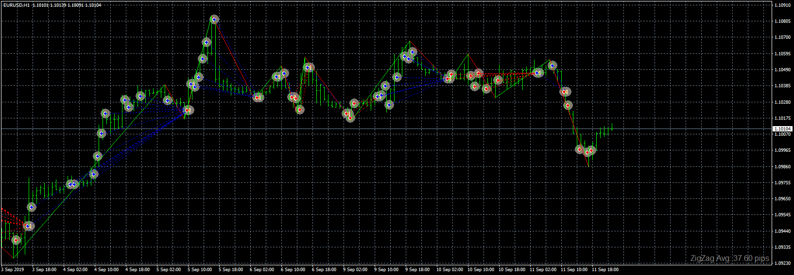
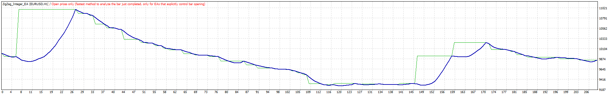
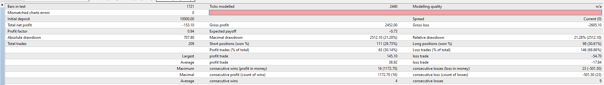

# ZigZag_Integer_EA

> Source: https://fxcodebase.com/code/viewtopic.php?f=38&t=68920  
> Forum: 38 · Topic 68920 · 1 post(s)

---

## ZigZag_Integer_EA

**Apprentice** · Mon Sep 16, 2019 4:48 am

 

 

Based on request.
[viewtopic.php?f=27&t=68903#p128591](https://fxcodebase.com/code/viewtopic.php?f=27&t=68903#p128591)
You will have to download ZigZag-Integer v1.1.mq4
[viewtopic.php?f=38&t=66415](https://fxcodebase.com/code/viewtopic.php?f=38&t=66415)

 [ZigZag_Integer_EA.mq4](files/128703/ZigZag_Integer_EA.mq4)
