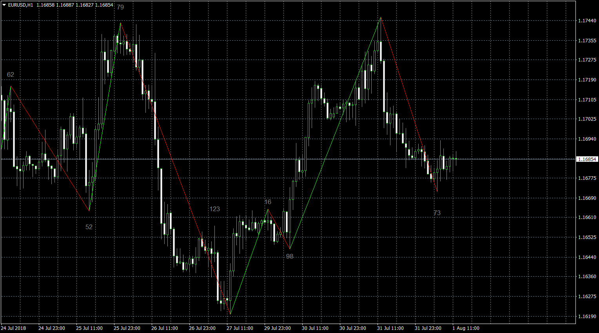

# ZigZag-Integer

> Source: https://fxcodebase.com/code/viewtopic.php?f=38&t=66415  
> Forum: 38 · Topic 66415 · 7 post(s)

---

## ZigZag-Integer

**Apprentice** · Wed Aug 01, 2018 9:05 am

Based on request.
[viewtopic.php?f=27&t=66311](https://fxcodebase.com/code/viewtopic.php?f=27&t=66311)

 [ZigZag-Integer.mq4](files/120249/ZigZag-Integer.mq4)

---

## Re: ZigZag-Integer

**Fx4mt.com** · Sat Feb 09, 2019 3:46 pm

Apprentice, I'm sorry for causing confusion. I've updated my request to this thread, as this indicator better suits me than the other ZigZag indicator I originally requested this on.

Can you code this to where it outputs an average of the last number of X zigzags? Excluding the latest integer output.

Ideally the input number would be a user defined variable customized to however many periods the user prefers. I've attached a picture.

I am extremely grateful.

---

## Re: ZigZag-Integer

**Apprentice** · Mon Feb 11, 2019 4:40 am

Your request is added to the development list under Id Number 4465

---

## Re: ZigZag-Integer

**Fx4mt.com** · Mon Feb 11, 2019 6:40 pm

> **Apprentice wrote:**
> Your request is added to the development list under Id Number 4465

Thank you Apprentice

---

## Re: ZigZag-Integer

**Apprentice** · Wed Feb 13, 2019 5:26 am

[ZigZag-Integer v1.1.mq4](files/123868/ZigZag-Integer%20v1.1.mq4)

Indicator based strategy.
[viewtopic.php?f=38&t=68920](https://fxcodebase.com/code/viewtopic.php?f=38&t=68920)

---

## Re: ZigZag-Integer

**Fx4mt.com** · Wed Feb 13, 2019 6:54 pm

Unbelievable! It's perfect. Thank you so much.

---

## Re: ZigZag-Integer

**aleqsei** · Wed May 08, 2019 2:42 am

> **Fx4mt.com wrote:**
> Unbelievable! It's perfect. Thank you so much.

bro, try to search this mq4 indicator also...it might be similar to your request. it will display the # of pips and the # of candles. "zigzag with value bars 2.0". or find the latest version of this indicator. I am using it always..it helps me a lot to identify the reversal. once the counting of pips "stops", then confirmed it w/ ur other indicators. use it with "semafor" indicator by only "activating" the "level 3" option. ignore the level1 & level 2. try to use this settings: 10, 5, 3. goodluck!
