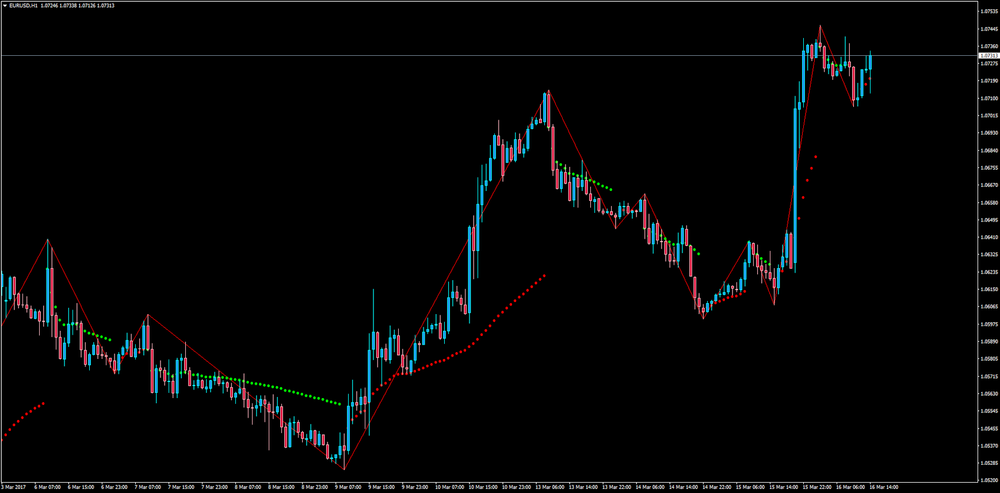

# ZigZag Moving Average

> Source: https://fxcodebase.com/code/viewtopic.php?f=38&t=64528  
> Forum: 38 · Topic 64528 · 1 post(s)

---

## ZigZag Moving Average

**Apprentice** · Thu Mar 16, 2017 1:00 pm

LUA Original: [viewtopic.php?f=17&t=3485](https://fxcodebase.com/code/viewtopic.php?f=17&t=3485)

Description:

MT4 version of the LUA original ZigZag Moving Average.

Standard realization of ZigZag is taken for base of the indicator.

From each node is drawn MA with increasing period.

For example:

"A" is a node of ZigZag.
ZMA[A]=Price_close[A],
ZMA[A+1]=(Price_close[A]+Price_close[A+1])/2,
ZMA[A+2]=(Price_close[A]+Price_close[A+1]+Price_close[A+2])/3 and etc.

Note: The ZigZag.mq4 indicator is called within the code so make sure you have it installed in the indicators folder.

 [ZMA.mq4](files/111495/ZMA.mq4)
