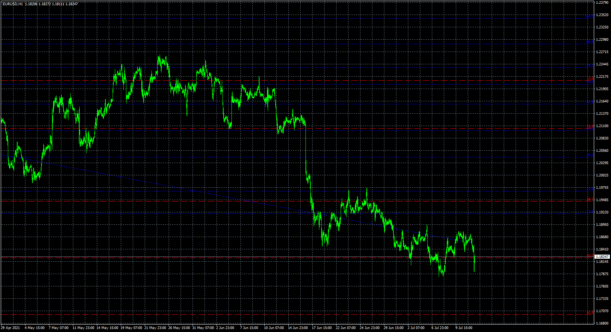

# zigzag_nk_fibo

> Source: https://fxcodebase.com/code/viewtopic.php?f=38&t=71407  
> Forum: 38 · Topic 71407 · 2 post(s)

---

## zigzag_nk_fibo

**Apprentice** · Mon Aug 09, 2021 8:10 am

Based on the request.
[https://fxcodebase.com/code/viewtopic.php?f=17&t=71389](https://fxcodebase.com/code/viewtopic.php?f=17&t=71389)

 [zigzag_nk_fibo.mq4](files/143157/zigzag_nk_fibo.mq4)

 [zigzag_nk_fibo.mq5](files/143157/zigzag_nk_fibo.mq5)

---

## Re: zigzag_nk_fibo

**widhie75** · Fri Oct 06, 2023 4:14 am

I try to use 'zigzag_nk_fibo.ex4' indicator for MT4 and I found some bug.

Maybe someone want to repair the bug?
