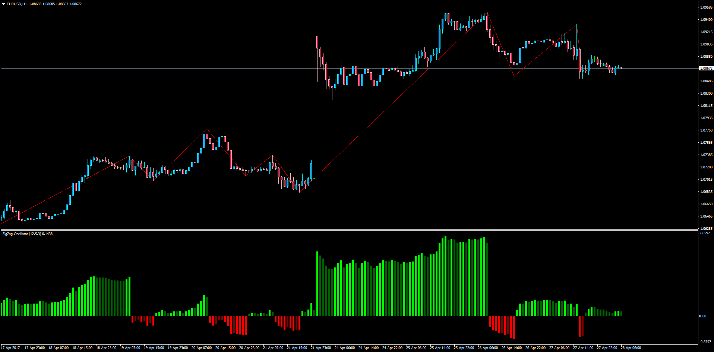

# ZigZag Oscillator

> Source: https://fxcodebase.com/code/viewtopic.php?f=38&t=64624  
> Forum: 38 · Topic 64624 · 6 post(s)

---

## ZigZag Oscillator

**Apprentice** · Fri Apr 28, 2017 3:36 am

LUA Original: [viewtopic.php?f=17&t=10714](https://fxcodebase.com/code/viewtopic.php?f=17&t=10714)

Description:

This indicator calculates the ZigZag values but the result is displayed in a subwindow as an oscillator, having the difference between price and the last ZZ point.

Formula goes as follows:

ZigZag_osc=100*(Price-Base)/Base, where
Base - the starting price of the current branches zigzag indicator.

 [ZigZag_Oscillator.mq4](files/112198/ZigZag_Oscillator.mq4)

---

## Re: ZigZag Oscillator

**kolikol** · Sun May 28, 2017 4:47 pm

Error in code: "not all control paths return a value" and mt freezing when trying to paste it into a chart

---

## Re: ZigZag Oscillator

**Apprentice** · Mon May 29, 2017 8:28 am

Try it now.

---

## Re: ZigZag Oscillator

**kolikol** · Mon May 29, 2017 3:33 pm

Thanks for error fixing, but when trying to paste it into a chart, mt still freezing

---

## Re: ZigZag Oscillator

**Apprentice** · Wed Jun 14, 2017 7:43 am

Try it now.

---

## Re: ZigZag Oscillator

**kolikol** · Fri Jul 07, 2017 6:13 pm

Perfect sir Many thanks.
