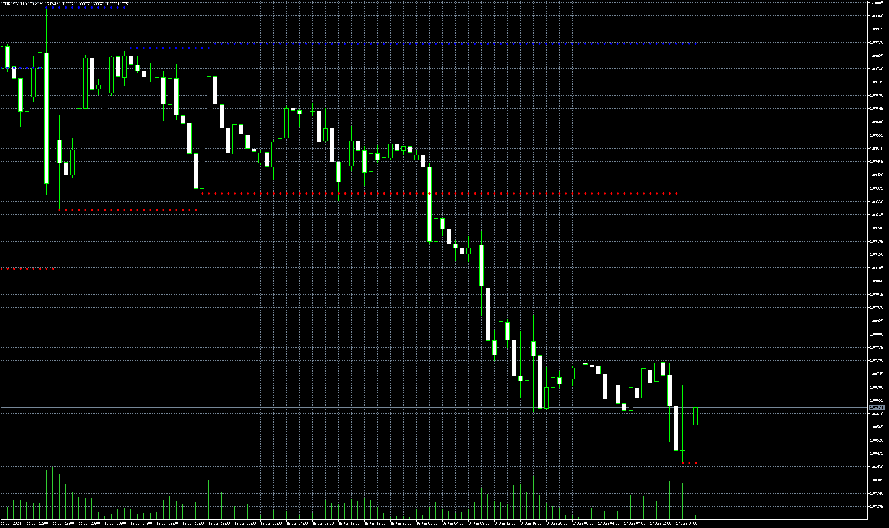
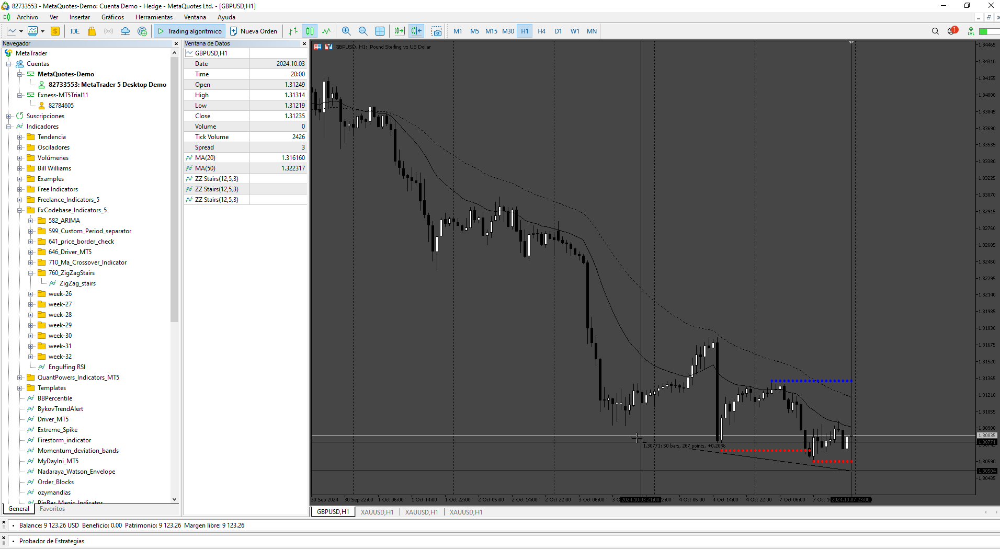

# ZigZag_stairs

> Source: https://fxcodebase.com/code/viewtopic.php?f=38&t=75186  
> Forum: 38 · Topic 75186 · 4 post(s)

---

## ZigZag_stairs

**Apprentice** · Sun Sep 08, 2024 2:14 pm

Based on the request.
[https://fxcodebase.com/code/viewtopic.php?f=17&t=75135](https://fxcodebase.com/code/viewtopic.php?f=17&t=75135)

 [ZigZag_stairs.mq5](files/156600/ZigZag_stairs.mq5)

---

## Re: ZigZag_stairs

**mpremium** · Sat Oct 05, 2024 5:30 am

thanks for MT5 version

i tested mt5 version but if i change barlimit to 50 high level not show correct plz fix it.

---

## Re: ZigZag_stairs

**Apprentice** · Sun Oct 06, 2024 3:42 am

We have added your request to the development list.
Development reference 760

---

## Re: ZigZag_stairs

**Apprentice** · Sat Oct 12, 2024 12:27 pm

Try this version.

 [ZigZag_stairs.mq5](files/156957/ZigZag_stairs.mq5)
