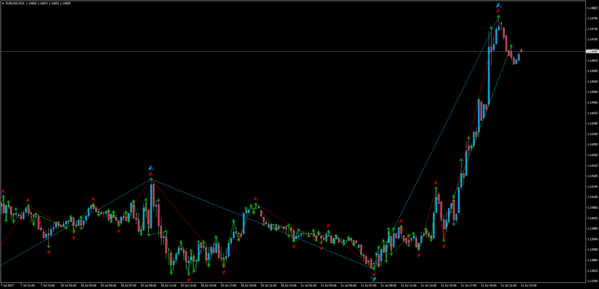

# ZigZag Swing

> Source: https://fxcodebase.com/code/viewtopic.php?f=38&t=64917  
> Forum: 38 · Topic 64917 · 1 post(s)

---

## ZigZag Swing

**Apprentice** · Thu Jul 13, 2017 3:29 am

Description:

MT4 version of the LUA Original "ZigZag Swing".
[viewtopic.php?f=17&t=63503](https://fxcodebase.com/code/viewtopic.php?f=17&t=63503)

1st order Swing: This is the swing pattern form by joining 1st order pivot. 1st order pivots are, a high preceded and followed by a lower high or a low with a higher low before and after that bar.

2nd order Swing: This is the swing pattern form by joining 2nd order pivot. Second order pivot is a simple pivot that is preceded by and followed by a first order pivot.

3rd Order Swing: This is the swing pattern form by joining 3rd order pivot. Third order pivot is a simple pivot that is preceded by and followed by a Second order pivot.

Each level fractal and swing can be turned on or off as per user needs.

 [ZigZag_Swing.mq4](files/113525/ZigZag_Swing.mq4)
