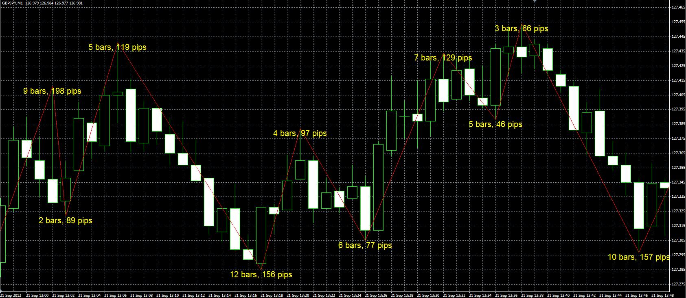

# ZigZag with bar and pips counter.

> Source: https://fxcodebase.com/code/viewtopic.php?f=38&t=23669  
> Forum: 38 · Topic 23669 · 5 post(s)

---

## ZigZag with bar and pips counter.

**Alexander.Gettinger** · Fri Sep 21, 2012 2:25 pm

Standard ZigZag with bar and pips counter.

 

Download:

 [ZigZag_Counter.mq4](files/40715/ZigZag_Counter.mq4)

---

## Re: ZigZag with bar and pips counter.

**Fx4mt.com** · Thu Feb 07, 2019 6:18 pm

Does anyone know how to edit this to reflect Yen Pairs correctly? I know it's as simple as taking off the last digit, but I was curious how to edit this myself.

Thank you.

---

## Re: ZigZag with bar and pips counter.

**Apprentice** · Fri Feb 08, 2019 6:16 am

You want to add two decimal places?

---

## Re: ZigZag with bar and pips counter.

**Fx4mt.com** · Fri Feb 08, 2019 9:08 pm

> **Apprentice wrote:**
> You want to add two decimal places?

Ignore my last request Apprentice, I actually prefer the way it is currently. I do have one more request however.

Can you code this to where it outputs an average of the last number of X zigzags?

Ideally the input number would be a user defined variable customized to however many periods the user prefers. I've attached a picture.

Also, I would like to help assist to this site in any way you see fit. You've helped me out tremendously over the years and I would like to give back. I will donate, but if there is any other ways I could help I would be happy to.

---

## Re: ZigZag with bar and pips counter.

**Fx4mt.com** · Sat Feb 09, 2019 1:41 pm

Apprentice, I found that this may be a better indicator to implement this on.

ZigZag Integer:

[viewtopic.php?f=38&t=66415](https://fxcodebase.com/code/viewtopic.php?f=38&t=66415)

Request remains the same, averaging the last number of X integers with output similar to my post above.

Thank you so much.
