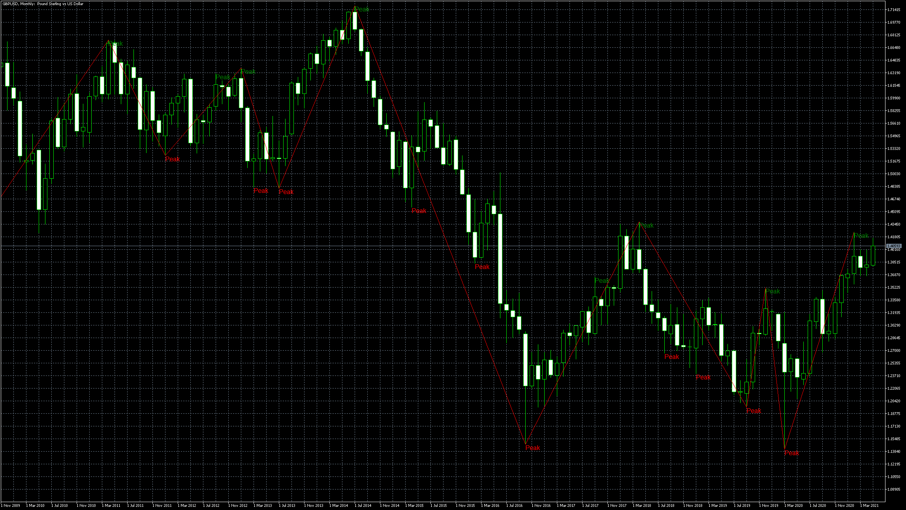
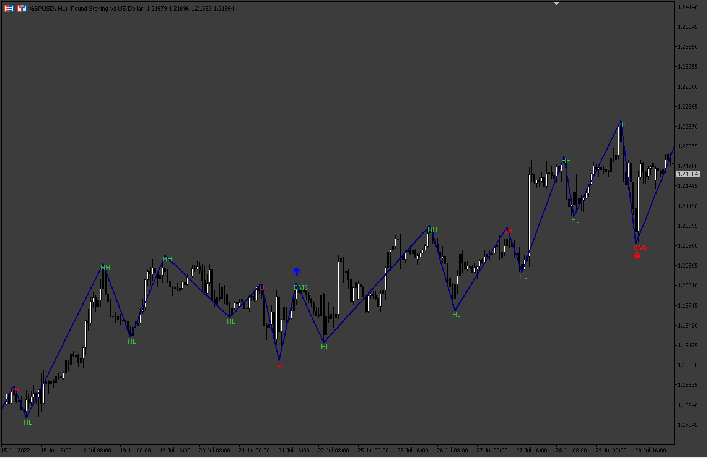
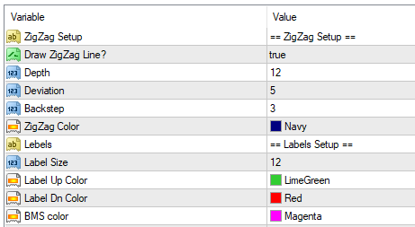
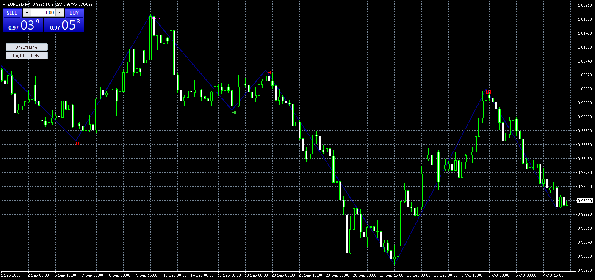
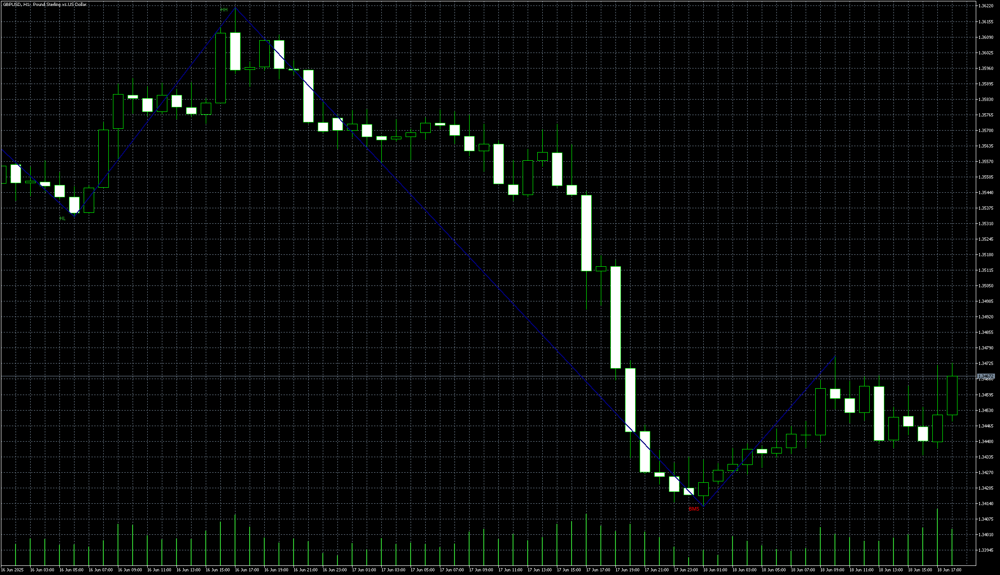
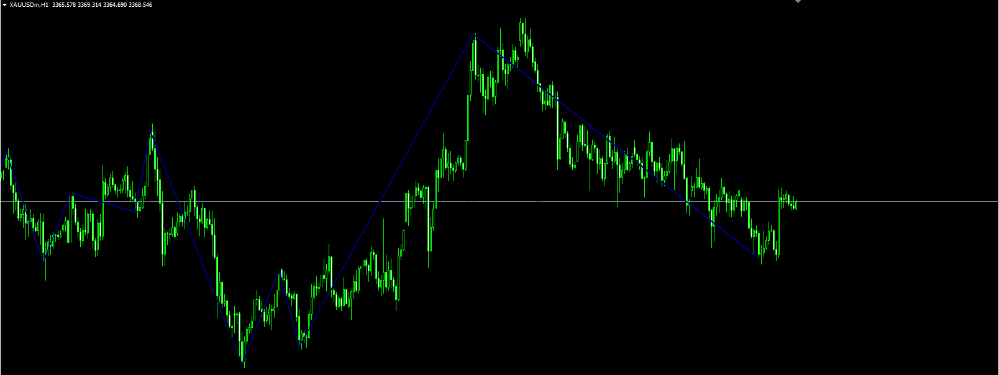

# ZigZag_with_counter

> Source: https://fxcodebase.com/code/viewtopic.php?f=38&t=71190  
> Forum: 38 · Topic 71190 · 21 post(s)

---

## ZigZag_with_counter

**Apprentice** · Fri May 14, 2021 4:50 am

 [ZigZag_with_counter.mq5](files/142084/ZigZag_with_counter.mq5)

---

## Re: ZigZag_with_counter

**jacryptoking** · Fri Apr 29, 2022 8:16 am

> **Apprentice wrote:**
>
>
> gbpusd-mn1-metaquotes-software-corp.png
>
>
>
>
> ZigZag_with_counter.mq5

Could you turn the peaks into market structure Lower low , lower high
Higher High , higher low . Equal Highs and equal lows.

When a higher High break a higher low and form a lower low labe as LL and as BMS (break of market structure) label

When a lower low break a lower high and form a higher High label as HH and BMS (BMS= break in Market structure)

Have option to set alert when a new lower low And higher high form and alert when feature also when BMS

---

## Re: ZigZag_with_counter

**Apprentice** · Mon May 02, 2022 8:44 am

We have added your request to the development list.
Development reference 271.

---

## Re: ZigZag_with_counter

**Apprentice** · Thu Aug 04, 2022 4:02 am

 [ZigZag_MarketStruct.mq5](files/146981/ZigZag_MarketStruct.mq5)

 [ZigZag_MS On Off.mq4](files/146981/ZigZag_MS%20On%20Off.mq4)

---

## Re: ZigZag_with_counter

**Teruyoshi** · Tue Sep 27, 2022 9:37 am

I have a new commer here and have just now registerd.
But before registeing, I have used your indicators and appreciate your generosity.
This time, I have a favor. Would you change ZigZag_MarketStruct.mq5 into mq4 and add on off button to it if possible?

---

## Re: ZigZag_with_counter

**Apprentice** · Wed Sep 28, 2022 10:58 am

We have added your request to the development list.
Development reference 592.

---

## Re: ZigZag_with_counter

**Teruyoshi** · Mon Oct 03, 2022 11:13 pm

Thank you for meeting my requirement.
I am looking forward to next post!

---

## Re: ZigZag_with_counter

**Apprentice** · Wed Oct 05, 2022 4:09 am

ZigZag_MS On Off.mq4 added.

---

## Re: ZigZag_with_counter

**Teruyoshi** · Wed Oct 05, 2022 5:18 am

Thanks you for meeting my request.
Yet, I am regret to say that nowhere can toggle button be found on chart...
And, Would it be possible for me to change each label size and color, which means to add parameter options? Many thanks in advance.

---

## Re: ZigZag_with_counter

**Apprentice** · Mon Oct 10, 2022 12:39 pm

Will ask the develeper.

 

For now, you can use parameters.

---

## Re: ZigZag_with_counter

**Apprentice** · Mon Oct 10, 2022 3:13 pm

 [ZigZag_MS Buttons.mq4](files/147852/ZigZag_MS%20Buttons.mq4)

TS2 version.
[https://fxcodebase.com/code/viewtopic.p ... 70#p159570](https://fxcodebase.com/code/viewtopic.php?f=17&t=76025&p=159570#p159570)

---

## Re: ZigZag_with_counter

**ahmedalhosenyy** · Tue Jan 10, 2023 11:42 pm

> **Apprentice wrote:**
>
>
> 271_pic.png
>
>
>
>
> ZigZag_MarketStruct.mq5
>
>
>
>
> ZigZag_MS On Off.mq4

Hello,
Is it applicable to have Lua indicator from **ZigZag_MarketStruct.mq5**

Thanks

---

## Re: ZigZag_with_counter

**Apprentice** · Wed Jan 11, 2023 10:57 am

We have added your request to the development list.
Development reference 24.

---

## Re: ZigZag_with_counter

**mahday12** · Sat Mar 15, 2025 8:44 am

This zigzag market structure.mq5 indicator is very interesting. Is it possible to show a dynamic label for what just happened as soon as possible (HH-HL-LH-LL) and add sound notifications ?

---

## Re: ZigZag_with_counter

**Apprentice** · Wed Jun 11, 2025 5:16 am

We have added your request to the development list.
Development reference 384

---

## Re: ZigZag_with_counter

**Apprentice** · Wed Jun 11, 2025 5:20 am

TS2 version.
[https://fxcodebase.com/code/viewtopic.p ... 70#p159570](https://fxcodebase.com/code/viewtopic.php?f=17&t=76025&p=159570#p159570)

---

## Re: ZigZag_with_counter

**Apprentice** · Wed Jun 18, 2025 11:00 am

 [ZigZag_MarketStruct_v2.mq5](files/159611/ZigZag_MarketStruct_v2.mq5)

---

## Re: ZigZag_with_counter

**Teruyoshi** · Thu Jun 19, 2025 2:20 am

Is it possible to turn ZigZag_MarketStruct_v2.mq5 into mq4 and to create a scanner type indicator?
 Thank you very much for your cooperation in advance

---

## Re: ZigZag_with_counter

**Apprentice** · Sat Jun 21, 2025 1:12 pm

We have added your request to the development list.
Development reference 410

---

## Re: ZigZag_with_counter

**Apprentice** · Tue Jun 24, 2025 6:14 am

 [ZigZag_MarketStruct_v2_MT4.mq4](files/159706/ZigZag_MarketStruct_v2_MT4.mq4)

---

## Re: ZigZag_with_counter

**marcelo2k9** · Tue Jun 24, 2025 6:23 am

> **Apprentice wrote:**
>
>
> 410.png
>
>
>
>
> ZigZag_MarketStruct_v2_MT4.mq4

Thank you Sir, you are the best in what you do
