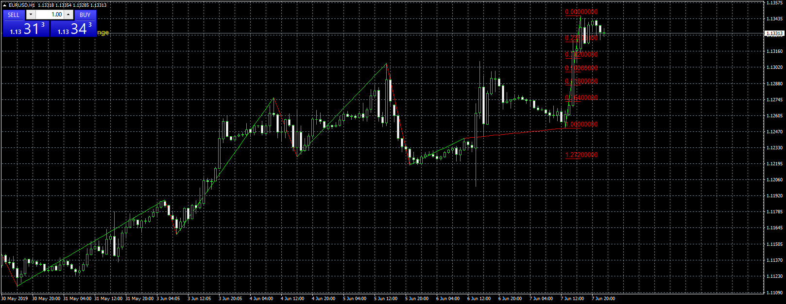

# ZigZag with Fibonacci.minifire18

> Source: https://fxcodebase.com/code/viewtopic.php?f=38&t=68551  
> Forum: 38 · Topic 68551 · 1 post(s)

---

## ZigZag with Fibonacci.minifire18

**Apprentice** · Sat Jun 08, 2019 2:43 am

Based on Lua / TS2 original.
[viewtopic.php?f=17&t=59571&start=50](https://fxcodebase.com/code/viewtopic.php?f=17&t=59571&start=50)

 [ZigZag with Fibonacci.minifire18.mq4](files/126789/ZigZag%20with%20Fibonacci.minifire18.mq4)
