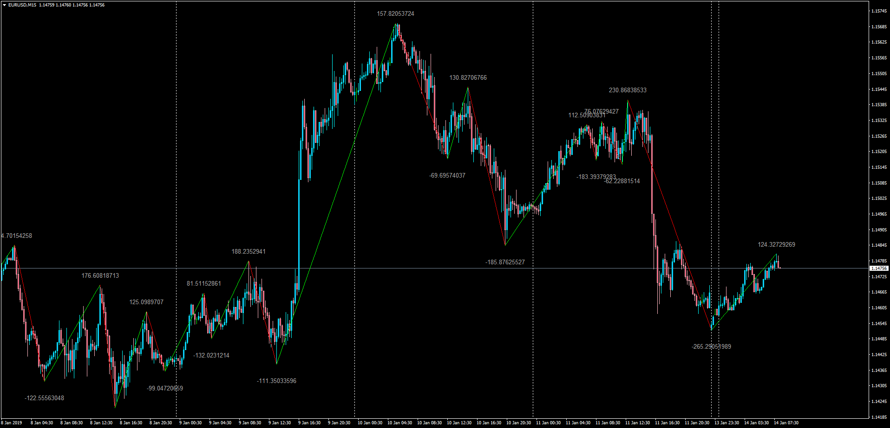

# ZigZag_with_Indicator_Value_Overlay

> Source: https://fxcodebase.com/code/viewtopic.php?f=38&t=67277  
> Forum: 38 · Topic 67277 · 1 post(s)

---

## ZigZag_with_Indicator_Value_Overlay

**Apprentice** · Thu Jan 17, 2019 4:51 am

LUA Original: [viewtopic.php?f=17&t=7009](https://fxcodebase.com/code/viewtopic.php?f=17&t=7009)

Description:

MT4 version of the LUA original indicator that allows you to see the value of another indicator over/under the turning points of the ZigZag indicator. Such values can be from the Stochastic, RSI, CCI, WPR, MACD or a Moving Average.

Note: ZigZag-Integer.mq4 is required - It can be found here: [viewtopic.php?f=38&t=66415](https://fxcodebase.com/code/viewtopic.php?f=38&t=66415) - Please make sure to have installed in the same indicators folder.

 [ZigZag_with_Indicator_Value_Overlay.mq4](files/123394/ZigZag_with_Indicator_Value_Overlay.mq4)
