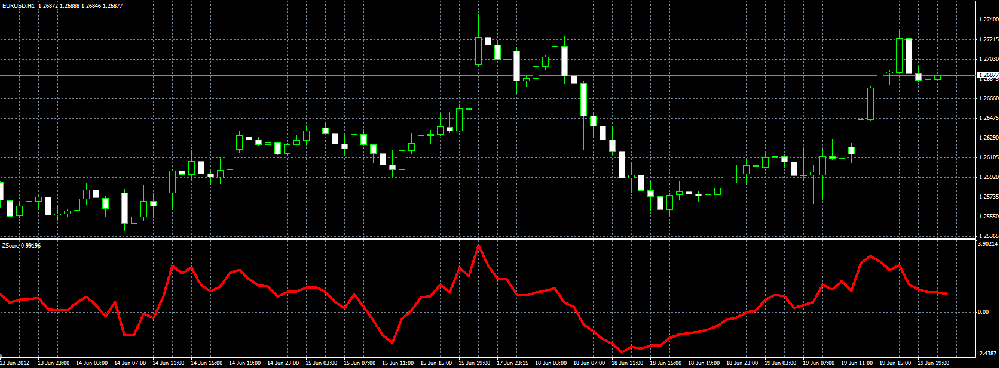

# ZScore indicator

> Source: https://fxcodebase.com/code/viewtopic.php?f=38&t=20398  
> Forum: 38 · Topic 20398 · 2 post(s)

---

## ZScore indicator

**Alexander.Gettinger** · Tue Jun 19, 2012 5:40 pm

Original indicator: [viewtopic.php?f=17&t=8619](https://fxcodebase.com/code/viewtopic.php?f=17&t=8619)

> ZScore = (Close - MVA of Close)/ Stdev of Close;
>
> Z Scope basically translate the movement of Price within the Bollinger Bands,
> to move within a fixed, deviation channel.
> Every time B.B. touches the channel, Z Scope do the same thing.

 

Download:

 [ZScore.mq4](files/35768/ZScore.mq4)

 [VWMA ZScore.mq4](files/35768/VWMA%20ZScore.mq4)

---

## Re: ZScore indicator

**logicgate** · Mon Sep 02, 2019 10:06 am

Thanks!
