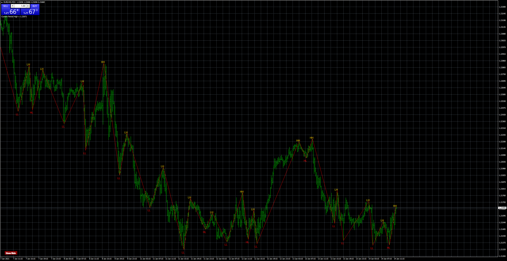

# zulufx_HHLHLLHL2

> Source: https://fxcodebase.com/code/viewtopic.php?f=38&t=70819  
> Forum: 38 · Topic 70819 · 13 post(s)

---

## zulufx_HHLHLLHL2

**Apprentice** · Thu Jan 14, 2021 5:01 am

Based on the request.
[viewtopic.php?f=27&t=70792](https://fxcodebase.com/code/viewtopic.php?f=27&t=70792)

 [zulufx_HHLHLLHL2.mq4](files/140195/zulufx_HHLHLLHL2.mq4)

---

## Re: zulufx_HHLHLLHL2

**im09p08** · Wed Feb 03, 2021 3:00 am

Sir, when I want to edit the file, especially the text (show / hide), the file gives an error and does not run

---

## Re: zulufx_HHLHLLHL2

**Apprentice** · Thu Feb 04, 2021 7:41 am

Can you provide your version?

---

## Re: zulufx_HHLHLLHL2

**im09p08** · Mon Feb 08, 2021 9:24 am

From the same version you sent
I downloaded it twice, because I thought it was damaged while downloading the file
(1) It is because it was downloaded twice, not the other version

---

## Re: zulufx_HHLHLLHL2

**Apprentice** · Tue Feb 09, 2021 6:12 am

Your request is added to the development list.
Development reference 169.

---

## Re: zulufx_HHLHLLHL2

**Chonde** · Wed Feb 10, 2021 11:56 pm

Sir,

Please insert alert after price create new HH & new LL

Thanks

---

## Re: zulufx_HHLHLLHL2

**Apprentice** · Fri Feb 12, 2021 11:12 am

im09p08
file was updated.

Chonde
Your request is added to the development list.
Development reference 189.

---

## Re: zulufx_HHLHLLHL2

**Apprentice** · Sun Feb 14, 2021 2:48 am

[zulufx_HHLHLLHL2.mq4](files/140704/zulufx_HHLHLLHL2.mq4)

Try it now.

---

## Re: zulufx_HHLHLLHL2

**Chonde** · Fri Feb 19, 2021 6:58 pm

Thanks sir, i will try it

---

## Re: zulufx_HHLHLLHL2

**im09p08** · Wed Mar 03, 2021 4:09 pm

> **Apprentice wrote:**
>
>
> The attachment **eurusd-m15-fxcm-australia-pty-2.png** is no longer available
>
>
> Based on the request.
> [viewtopic.php?f=27&t=70792](https://fxcodebase.com/code/viewtopic.php?f=27&t=70792)
>
>
> The attachment **eurusd-m15-fxcm-australia-pty-2.png** is no longer available

Hello
I want to run this indicator with different settings several times
When I run twice, only one button appears and it can no longer be run multiple times on the chart at the same time

Please make these changes to the original version I am sending
Please do not add alarms
Please attach the file in a separate post (do not update the first post)

---

## Re: zulufx_HHLHLLHL2

**Apprentice** · Thu Mar 04, 2021 12:18 pm

Your request is added to the development list.
Development reference 252.

---

## Re: zulufx_HHLHLLHL2

**Apprentice** · Wed Mar 10, 2021 2:30 am

[zulufx_HHLHLLHL_orginal.mq4](files/141115/zulufx_HHLHLLHL_orginal.mq4)

Try this version.

---

## Re: zulufx_HHLHLLHL2

**im09p08** · Wed Mar 10, 2021 7:12 pm

> **Apprentice wrote:**
>
>
> zulufx_HHLHLLHL_orginal.mq4
>
>
> Try this version.

this is great. thank you
Please also specify an ID for HH HL LL LH labels
These labels are disturbed together
